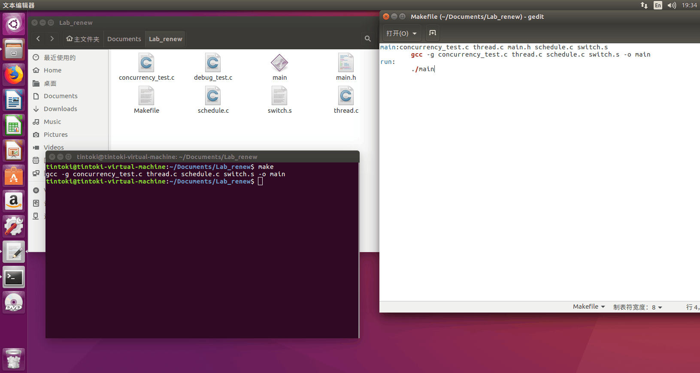
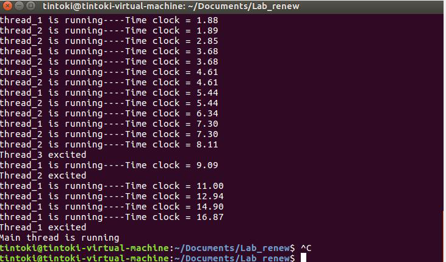
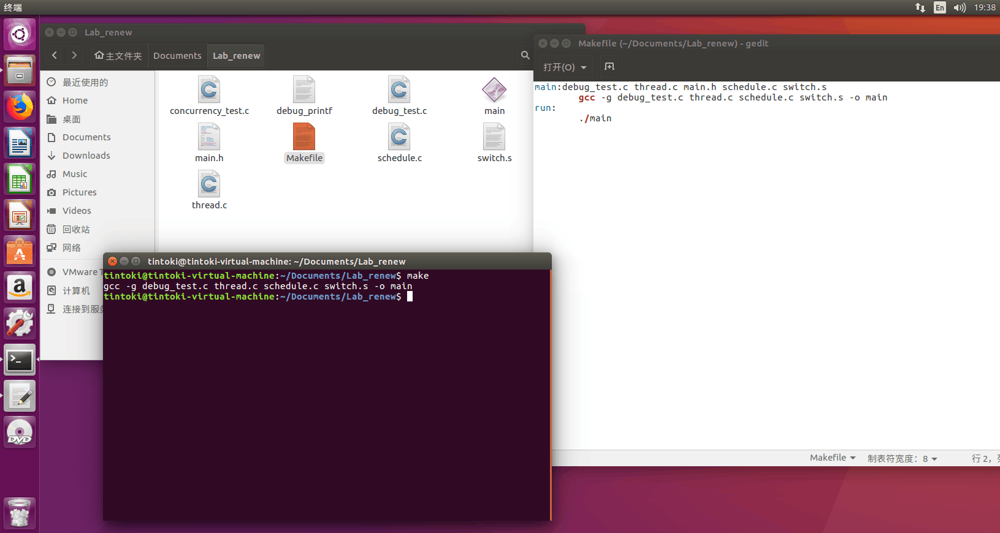
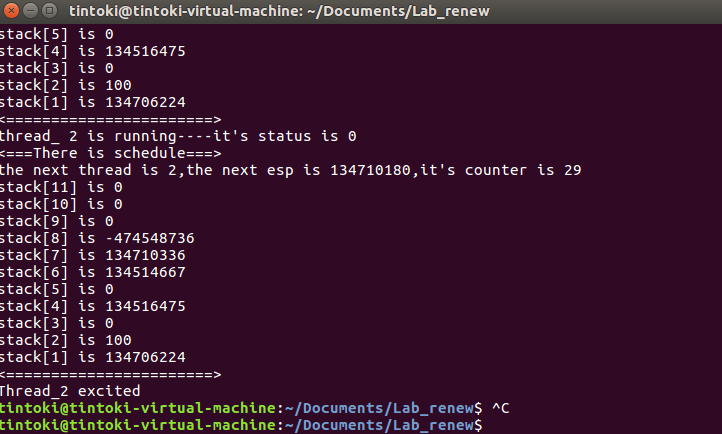
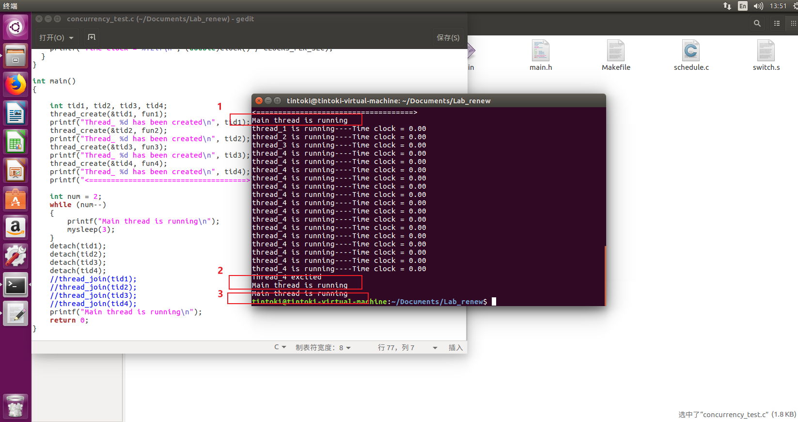

# 一、实验要求

用户态线程创建需要实现的功能及说明如下

1. 提供创建用户态线程的机制
   - 栈的空间大小自己定义
   - 线程的数量上限可以设置成一个常数
   - 注意要清理执行完的线程所占用的空间
2. 上下文切换
   - 了解上下文的概念，搞清楚包含哪些寄存器
   - 明白如何切换栈
   - 这个部分需要手写，不能借用外部函数
3. 线程状态的管理
   - 线程可以在多种状态之间来回切换，状态的数量最少有3个
4. random调度策略
   - 目前调度器不需要tick，上下文切换可以是显式调用
   - 调度策略随意发挥，没有任何要求，主要在lab2中实现
5. 测试程序
   - 测试程序需要同时创建多个线程，体现出用户态线程的并发能力
   - 测试时打印出上下文切换过程中信息，主要是提示切换的时机、切换前后线程的id、两个线程的状态

# 二、实验环境

本次实验使用的环境参考如下

| 环境项目     | 配置             |
| ------------ | ---------------- |
| 操作系统     | Ubuntu 16.04     |
| 操作系统位数 | 32位             |
| 开发工具     | gedit、make、gcc |
| 开发语言     | C语言            |
| 指令集架构   | X86              |
| 内存         | 4GB              |
| 处理器       | 1                |


# 三、实验内容

## 1.前置知识点

`所谓用户态线程就是把内核态的线程在用户态实现了一遍而已`，目的是更轻量化（更少的内存占用、更少的隔离、更快的调度）和更高的可控性（可以自己控制调度器）。用户态所有东西内核态都「看得见」，只是对于内核而言「用户态线程」只是一堆内存数据而已，这就意味着用户级线程不是真正的线程，所以有时候我们也说，“对操作系统而言，用户态线程具有透明性”。

### 1.1 函数传参

在汇编层面，C语言如何处理函数调用过程中的参数传递？主要有如下几点：

- __cdecl：C Declaration的缩写，即C语言默认的函数调用方法。所有参数`从右到左`依次入栈，这些参数由调用者清除，称为`手动清栈`。被调用函数不会要求调用者传递多少参数，调用者传递过多或者过少的参数，甚至完全不同的参数都不会产生编译阶段的错误；
- __stdcall：Standard Call 的缩写，是 C++ 的标准调用方式。所有参数`从右到左`依次入栈，如果是调用类成员的话，最后一个入栈的是 this 指针。这些堆栈中的参数由被调用的函数在返回后清除，使用的指令是 retnX，X 表示参数占用的字节数，CPU 在 ret 之后自动弹出 X 个字节的堆栈空间，称为`自动清栈`。函数在编译的时候就必须确定参数个数，并且调用者必须严格的控制参数的生成，不能多，不能少，否则返回后会出错；
- __pascal：Pascal 语言（Delphi）的函数调用方式，也可以在 C/C++ 中使用，参数压栈顺序与前两者相反。返回时的清栈方式与 _stdcall 相同；
- __fastcall：编译器指定的快速调用方式。由于大多数的函数参数个数很少，使用堆栈传递比较费时，故通常规定将前两个（或若干个）参数由寄存器传递，其余参数还是通过堆栈传递。不同编译器编译的程序规定的寄存器不同，返回方式和 _stdcall 相同；
- __thiscall：为了解决类成员调用中 this 指针传递而规定，要求把 this 指针放在特定寄存器中，该寄存器由编译器决定，VC 使用 ecx，Borland 的 C++ 编译器使用 eax，返回方式和 _stdcall 相同；

> _fastcall 和 _thiscall 涉及的寄存器由编译器决定，因此不能用作跨编译器的接口，故 Windows 上的 COM 对象接口(平台无关、语言中立、位置透明、支持网络的中间件技术)都定义为 _stdcall 调用方式；

> C 语言中不加说明默认函数为 _cdecl 方式（C中也只能用这种方式），C++ 也一样，但是默认的调用方式可以在 IDE 环境中修改；

### 1.2 堆栈变化

在_cdecl的函数调用规范下，CPU目前执行的函数为father，该函数即将调用函数child，函数栈空间如何变化呢？

```c
void father(){
    child(120); 
}
```

```c
void child(int a){
    int b=a;
}
```

上述两个函数经过编译后产生如下汇编代码

```assembly
father proc:
	push eax	;将寄存器eax中的数据送入栈中
	mov eax,120	;将120送入eax寄存器
	push eax    ;将寄存器eax中的数据送入栈中，这一步等价于将参数传递给child函数
	call child	;调用child函数
	pop eax		;从栈顶取出数据送入eax
	ret		    ;汇编ret指令含义是子程序的返回指令
```

```assembly
child proc:
	push ebp		;寄存器ebp中的数据送入栈中
	mov ebp,esp		;将esp中的值送入ebp中
	mov eax,[ebp+8]	;取出参数到eax寄存器中，因为ebp指向当前栈顶，而120数据在栈中father函数的pop指令的返回地址之后，因此需要偏移8字节
	ret
```

### 1.3 线程切换

线程的切换有以下几个要点：

- 我们需要为每一个线程设立一个独立的，互相不干扰的栈空间；

- 当线程发生切换的时候，当前线程被切换之前，需要把自己的现场进行完好的保留，同时记录下一条需要执行指令的指令地址；

- 把CPU的栈顶指针寄存器esp切换到即将被调入的线程的堆栈的栈顶地址，完成线程栈空间的切换；

程序执行实际是汇编指令在CPU上逐条执行，对于单核CPU(也就是我们当前的实验环境)来说，永远只有一条控制流(这意味着咱们模拟出来的多线程本质上还是单线程)；

汇编指令执行的时候依赖它所在的CPU环境：

- 通用寄存器：eax、edx、ecx、ebx、esp、ebp、esi、edi
- 标志寄存器：eflags
- 指令寄存器：eip （eip用来保存下一条要被指令的地址）
- 栈：用于保存指令序列执行过程中的临时数据

上述通用寄存器中esp保存的是栈顶指针内存地址的值，下面几条指令都依赖于esp工作：

\- call指令把它后面的指令地址保存到esp指向的内存单元，同时修改eip。如call 0x2000，先把call 0x2000的下一条指令地址压栈，同时修改eip为0x2000；

\- ret指令把esp指向的内存单元中的值保存到eip；

\- push指令把值保存到esp指向的内存单元；

\- pop把esp指向的内存单元的值取出；

为啥要介绍上面的知识点？因为这涉及控制流的切换，实际上就是`更改esp的栈顶指针`顺带把`通用寄存器中保存的环境进行修改`以适应新指令的执行环境（通常新的指令的也保存在栈中），通常有多种手段来保存寄存器的环境，最简单的一种就是将其保存到定义好的结构体中，当然我们实际开发中使用的是将当前寄存器的环境保存到当前使用的栈中；

当然线程切换不仅仅只是简单的控制流切换，同时还应该保存当前执行的环境（当前寄存器环境以及当前栈顶位置等），我们可以将当前寄存器的环境保存在当前线程的运行栈中，在切换控制流的同时切换寄存器环境，这就是所谓的上下文切换；

在栈中进行线程以及上下文的切换流程图如下


- 线程 0 准备切换时，将当前 CPU 中的寄存器环境一个一个压入到自己的栈中，最后一个压栈的是 eflags 寄存器；

- 线程 0 将自己的栈顶指针（保存 eflags 的那个位置）保存到全局数组 task[0] 中；
- 线程 0 从全局数据 task 中取出下一个线程的栈顶，假设下一个要运行的线程是 1 号线程，则从 task[1] 中取出线程 1 的栈顶指针保存到 CPU 的 esp 寄存器中。此时意味着栈已经被切换。栈切换完成后，本质上已经在线程 1 中了；
- 线程 1 将自己栈中的寄存器环境 pop 到对应的 CPU 寄存器中，比如第一个 pop 到 eflags 中，最后一个是 pop ebp；

用户级线程切换不同于内核级线程切换，在多个用户级线程之间实现切换只需要在切换位置（俗称调度点）调用一个普通的调度切换函数schedule即可，这个函数主要实现的功能就是从线程队列中选择一个合适的线程，接着将当前线程切换为被选择的线程，对应我们分别会设计的线程调度函数pick以及上下文切换函数switch_to_next，需要注意的是pick函数和switch_to_next函数一定是一起出现的，单独出现没有意义，因此我们会将这两个函数封装在schedule函数中；

pick函数实现了从一系列可调度线程中选择一个线程进行切换；swith_to_next函数实现的是被选中线程和当前线程的上下文的切换，这部分涉及一些汇编的知识，但整体上来说还是能够理解，在函数封装章节中我们会详细介绍；

所以接下来的问题是如何确定调度点也就是线程需要进行切换的位置，首先我们先声明本实验基于抢占式线程调度的背景（至于线程调度是什么我们后面会介绍），因此线程的切换可以分为主动切换和被动切换，主动切换是指线程主动让出CPU，被动切换是指线程因为被操作系统强制结束执行让出CPU；

实现主动切换非常简单，我们只需要在进行主动切换的地方手动添加schedule实现线程切换，当然这只是基本思想，实际上我们在进行主动切换之后还需要知道线程什么时候能够被切回来，这就引出了my_sleep函数，我们将在后面进行详细解析；

那应该如何实现被动切换呢？基于时间片的基本原理，为每个线程分配一定数量的时间片，线程在执行的过程中会逐渐消耗时间片数量，当它消耗掉自己所有所有的时间片后就需要调用schedule函数进行切换（无论此时它是否执行完成自己的任务）；

### 1.4 线程调度

线程切换中我们是否会思考这样一个问题 —— 如何在一系列可供选择的就绪线程中选择下一个线程（其目的是将CPU分配给这个线程）是良好的，这就引出我们下面要讨论的`线程调度`，这也是pick函数要做的事；

线程调度的两种方式：

- 非抢占方式：这种方式下一旦把CPU分给一个线程，该线程就会保持CPU直到终止或转换到等待状态，这种方式不能用于分时系统和多数实时系统（无法处理紧急任务）；
- 抢占方式：若有某个更加重要的线程需要使用处理机的时候，立即暂停正在执行的线程，将处理机分配给这个更加重要的线程，这种方式可以处理更高优先级的线程，也可以实现时间片的轮流处理；

本次实验采用抢占方式进行线程调度，便于实现之后的时间片轮转调度；

现在我们回到刚开始的问题，如何选择一个线程是良好的？最简单的方式当然是直接在就绪线程队列中选择第一个线程调度执行，这也是FCFS先来先服务调度算法的基本思想，特性是公平，缺点是很可能导致任务的平均周转时间较长，我们用下面这个例子举例


根据FCFS的基本思想我们可以得到其算法实例如下


则其平均周转时间为(10+39+42+49+61)/5=40.2；

FCFS调度算法是一种非交互式的调度算法，在进行某些交互任务的时候表现并不会很好，非常影响响应时间；假如我们在一段时间内让所有的任务都有机会向前推进（基于时间片的调度）而不是呆呆的让抢占到CPU的任务执行完毕（非交互式调度）才让出CPU，是否可以优化响应时间呢？这就引出时间片轮转RR调度：将一段时间等分（执行时间片）的分割给每个任务，当前任务的时间片用完后就会切换到下一个任务；

在RR算法中核心是选择合适的时间片大小和数量：时间片设得太短会导致过多的线程切换，降低了CPU效率；而设得太长又可能引起对短的交互请求的响应变差；

## 2.数据结构设计

### 2.1 线程控制块

TCB与PCB相似，只是TCB中保存的线程状态少于PCB中保存的，通过控制TCB中的数据，可以对线程的状态等一系列事务进行操作

```c
struct task_struct {
  int id;  				  //线程的标识符，即线程id
  void (*thread_func)();   //指向线程函数的函数指针，我们传入该参数的时候，需要把函数的地址以整数的形式传入
  int esp; 				  //用来在发生线程切换时保存线程的栈顶地址，简单来说esp记录了栈顶指针
  unsigned int wakeuptime; // 线程唤醒时间;当线程调用sleep函数之后， Wakeuptime便被设置为当前的时间加上线程需要休眠的时间，同时线程的状态被设置为thread_sleep。当线程发生调度的时候，调度函数会检查每一个处于睡眠状态的线程，如果当前的时间大于wakeuptime则将其状态设置为THREAD_RUNNING，重新参与现场的调度
  int status; 			  // 线程状态，包括RUNNING，SLEEP，EXIT，READY等
  int counter; 			  // 我们为每一个线程设定了一定数量的时间片，counter记录了线程当前还有多少时间片，每一个时间片都是一个单位的时间，比如说10毫秒。每一个时间片结束都会发生一次调度中断，这个中断的中断服务子程序会检查当前线程的counter是否小于0，如果小于零则代表当前线程的时间片用完了而需要进行线程的调度，调度算法会从线程队列中寻找另外一个可调度的而且counter大于0且counter最大的线程进行调度，否则的话直接结束中断。
  int priority; 		  // 线程优先级；当所有的线程时间片都已经用完的时候，需要重新为每一个线程分配时间片。每一个线程分配多少的时间变得这个就由priority来决定。优先级高的线程能够分配到更多的时间片，而优先级低的线程分配到时间片就相对的少，这样便实现了线程之间的优先级，让优先级高的线程能够得到更多的CPU处理时间，而线程优先级低的线程CPU处理时间则相对较少。
  int stack[STACK_SIZE];   //线程运行栈
};
```

注意，初始化的时候stack栈预先保存了现场的初始状态便于线程进行调度，esp初始时指向的就是stack的栈顶，因此在初始化线程的时候需要在stack中设置好线程上下文的初始环境，同时传入start函数的地址作为启动函数的地址；

### 2.2 线程队列

TCB仅仅只是针对每一个线程进行设计，我们还需要一个数据结构将所有线程集合起来让调度算法对其进行统一操作，这个数据结构就是线程队列，我们使用task数组来保存线程结构体指针

```c
#define THR_TASKS 32 
static struct thread_struct init_task = {0, NULL, THREAD_STATUS_RUNNING, 0, 0, 15, 15, {0}};
struct thread_struct *current = &init_task; 
struct thread_struct *task[THR_TASKS] = {&init_task,};
```

## 3.函数封装

整个程序的主要函数及其功能如下：

1. 通过调用thread_create函数(这个是自己写的函数，不是pthread_create)创建线程；
2. 通过两种方式启动线程：
   - 调用函数detach实现线程的分离式启动（父线程不必等待子线程执行结束，可以继续执行）；
   - 调用函数thread_join实现阻塞式启动（父线程等待该子线程结束后才能继续执行）；
3. 线程的状态转换：通过一系列的线程状态函数实现线程的状态转换
4. 线程切换：线程的切换方式有两种：
   - 主动切换my_sleep：调用schedule切换到指定线程，并在一段时间后wakeup可调度；
   - 时钟中断切换do_timer：通过设置时钟中断，中断后执行schedule函数来完成；
5. 线程调度pick：采用时间片轮转调度算法，根据线程优先级为每个线程设置时间片；

### 3.1 线程创建函数

```c
//线程创建函数
int thread_create(int *tid, void (*start_routine)()){
    int id = -1;                                                                                    //初始化线程id
    struct thread_struct *tsk = (struct thread_struct *)malloc(sizeof(struct thread_struct));       //为线程分配一个结构体
    while (++id < THR_TASKS && task[id]);                                                           //在线程队列中寻找位置
    if (id == THR_TASKS)                                                                            //如果没有位置了则创建失败
        return -1;
    task[id] = tsk;                                                                                  //将线程结构体放在task线程队列中
    if (tid) *tid = id;                                                                              //将线程队列的索引号作为id号传给tid，便于之后传出

    //初始化线程结构体
    tsk->id = id;                                                                                    //设置线程id
    tsk->thread_func = start_routine;                                                                //线程过程函数，对应之后会编写的fun1,fun2...
    int *stack = tsk->stack;                                                                         //线程运行栈
    tsk->esp = (int)(stack + STACK_SIZE - 11);                                                       //获取esp栈顶指针
    tsk->status = THREAD_RUNNING;                                                                    //线程状态设置为RUNNING
    tsk->wakeuptime = 0;                                                                             //设置Wakeuptime
    tsk->counter= 15;                                                                                //时间片的单位不是纳秒、微秒或者毫秒，而是嘀嗒数，此处初始化为15个嘀嗒数
    tsk->priority = 15;                                                                              //设置线程优先级

    //初始化线程运行栈，地址从低到高
    stack[STACK_SIZE - 11] = 0;         // eflags
    stack[STACK_SIZE - 10] = 0;         // eax
    stack[STACK_SIZE - 9] = 0;          // edx
    stack[STACK_SIZE - 8] = 0;          // ecx
    stack[STACK_SIZE - 7] = 0;          // ebx
    stack[STACK_SIZE - 6] = 0;          // esi
    stack[STACK_SIZE - 5] = 0;          // edi
    stack[STACK_SIZE - 4] = 0;          // old ebp
    stack[STACK_SIZE - 3] = (int)start; // ret to start，线程第一次被调度的时候会在此启动
    //start函数栈，刚开始进入start函数的运行栈环境
    stack[STACK_SIZE - 2] = 100;        // ret to unknown
    stack[STACK_SIZE - 1] = (int)tsk;   // start函数的参数，是一个线程结构体指针
    return 0;
}
```

### 3.2 线程启动函数

主要有两种类型的启动函数，分离式启动和阻塞式启动；

```c
//线程阻塞式启动
int thread_join(int tid){
    while(task[tid]->status != THREAD_EXIT)//只要不是exit状态的线程，持续schedule
    {
        schedule();
    }
    free(task[tid]);   					//释放task队列相应位置内存
    task[tid] = NULL;  					//task队列相应位置设置为NULL
}
```

```c
//线程分离式启动
void detach(int tid){
  if(task[tid]!=NULL && task[tid]->status==THREAD_STOP&& task[tid]->status!=THREAD_EXIT){
    task[tid]->status=THREAD_RUNNING;
    schedule();
  }
}
```

### 3.3 线程调度函数

主要有两个版本，简单版本和基于时间片调度的版本；

```c
static struct thread_struct *pick_simple() {     //最简单的pick函数，直接在线程队列中寻找第一个不空的线程
  int next=0;
  int current_id  = current->id;
  int i = current_id;
  while(1) {                                    // 寻找下一个不空的线程
    i = (i + 1) % THR_TASKS;
    if (task[i]) {
      task[next]=task[i];
      break;
    }
  }
  return task[next];
}
```

```c
//pick函数的任务是从task数组中挑选一个合适的线程并返回其线程结构体指针（这部分是参照的别人的写法）
//每次执行pick函数都会挑选一个时间片值最大的线程并返回
static struct thread_struct *pick()
{
    int i, next, c;
    for (i = 0; i < THR_TASKS; ++i)														//首先需要检查每个线程的唤醒时间是否小于当前时间，如果是，则将该线程调整为可调度状态
    {
        if (task[i] && task[i]->status != THREAD_EXIT && getmstime() > task[i]->wakeuptime)
        {
            task[i]->status = THREAD_RUNNING;
        }
    }
    while (1)																		 //基于优先级的时间片轮转
    {	
        c = -1;
        next = 0;
        for (i = 0; i < THR_TASKS; ++i)
        {
            if (!task[i])
                continue;
            if (task[i]->status == THREAD_RUNNING && task[i]->counter > c)
            {
                c = task[i]->counter;
                next = i;
            }
        }
        if (c)
            break;
        if (c == 0)																		 // 如果所有的THREAD_RUNNING任务的时间片的值都是0，则重新调整时间片的值
        {
            for (i = 0; i < THR_TASKS; ++i)
            {
                if (task[i])
                {
                    task[i]->counter = task[i]->priority + (task[i]->counter >> 1);
                }
            }
        }
    }
    return task[next]; 																	//返回选择的线程结构体
}
```

### 3.4 上下文切换函数

```assembly
/*void switch_to(struct task_struct *next)*/
.section .text
.global switch_to_next
switch_to_next:
  call closealarm /* 模拟关中断 */
  push %ebp
  mov %esp, %ebp /* 更改栈帧，以便寻参 */

  /* 保存现场 */
	push %edi
	push %esi
	push %ebx
	push %edx
	push %ecx
	push %eax
  pushfl
 
  /* 准备切换栈 */
  mov current, %eax /* 取 current 基址放到 eax */
  mov %esp, 8(%eax) /* 保存当前 esp 到线程结构体 */ 
  mov 8(%ebp), %eax /* 取下一个线程结构体基址*/
  mov %eax, current /* 更新 current */
	mov 8(%eax), %esp /* 切换到下一个线程的栈 */

  /* 恢复现场, 到这里，已经进入另一个线程环境了，本质是 esp 改变 */
  popfl
	popl %eax
	popl %edx
	popl %ecx
	popl %ebx
	popl %esi
	popl %edi

	popl %ebp
  call openalarm /* 模拟开中断  */
  ret

```

----

### 3.5 主动切换函数

```c
//sleep函数，用于设置wakeuptime以及线程状态，主动将该线程切换（可以看作是对schedule主动切换的优化）
void mysleep(int seconds)
{ 
    current->wakeuptime = getmstime() + 1000 * seconds;	//设置当前线程的唤醒时间 
    current->status = THREAD_STATUS_SLEEP;			   //将线程置于休眠状态
    schedule();										//调用schedule函数准备调度
}
```

### 3.6 时间中断切换函数

```c
//基于时间中断的调度
//基本思想是系统在每个嘀嗒中产生一个时钟中断并进入时钟中断处理函数do_timer，在do_timer中让线程的时间片值减1直到0，执行schedule函数
static void do_timer()				//do_timer在每个嘀嗒数中自动运行一次
{ 
    if (--current->counter > 0)
        return;
    current->counter = 0;
    schedule();
}
```

## 4.模块设计

### 4.1 main.h

头文件中主要包含了整个程序需要使用的外部头文件，宏定义了一些常量以及线程状态、线程结构体，同时声明了程序的一系列函数；

```c
#include <sys/time.h>
#include <signal.h>
#include <stdio.h>
#include <stdlib.h>
#include <unistd.h>
#include <time.h>

#define STACK_SIZE 1024                         //最大栈空间
#define THR_TASKS 32                            //最大线程个数                        

#define THREAD_STATUS_RUNNING 0                			//线程处于可调度队列，暂时还没得到cpu资源
#define THREAD_STATUS_SLEEP 1                  			//线程睡眠，此时线程不可被cpu调度	
#define THREAD_STATUS_READY 2                  			//线程正在运行
#define THREAD_STATUS_EXIT 3                   			//线程退出
#define THREAD_STATUS_STOP 4 						   //线程受到调控，停止运行
#define THREAD_STATUS_BLOCK 5                  			//线程因为等待某个时间阻塞，此时不可被cpu调度

struct thread_struct {
  int id;                                       //线程标识符
  void (*thread_func)();                        //指向线程过程函数的函数指针，用来记录线程执行的函数
  int esp;                                      //stack的栈顶指针
  unsigned int wakeuptime;                     //线程唤醒时间
  int status;                                   //线程状态
  int counter;                                  //时间片数量
  int priority;                                 //线程优先级
  int stack[STACK_SIZE];                        //线程运行栈
};

void start(struct thread_struct *tsk);					//start函数用于统一管理线程过程函数
int thread_create(int *tid, void (*start_routine)());	  //线程创建函数
int thread_join(int tid);							   //线程阻塞式启动，父线程等待该子线程结束后才能继续执行
void detach(int tid);								   //线程分离式启动，父线程不必等待子线程执行结束，可以继续执行
static unsigned int getmstime();						//获取毫秒精度的时间
static struct thread_struct *pick();					//线程调度函数，基于时间片的调度
void closealarm();									   //关中断函数
void openalarm();									   //开中断函数
void schedule();									   //调度切换函数，封装了pick以及switch_to_next函数
void mysleep(int seconds);								//主动切换函数
static void do_timer();									//时间片中断切换函数
void switch_to_next();									//上下文切换函数
void wait_thread();										//线程阻塞函数，令线程进入阻塞状态 THREAD_STATUS_BLOCK
```

### 4.2 thread.c

线程源文件，主要包含线程创建、线程启动、线程状态切换等函数；

### 4.3 schedule.c

线程切换源文件，主要包含主动切换、时间片中断切换、线程调度等函数；

### 4.4 concurrency_test.c

线程并发性测试程序，同时创建多个线程，测试用户态线程的并发能力；

### 4.5 debug_test.c

线程切换测试程序，测试时打印出上下文切换过程中信息，主要提示切换的时机、切换前后线程的id、两个线程的状态；

### 4.6 switch.s

上下文切换函数，这部分使用汇编语言进行编写，主要涉及寄存器之间的值传递；

### 4.7 Makefile

Makefile文件，用于Linux下多文件编译命令make；

## 5.实验结果

### 5.1 并发性测试

首先编译得到main可执行文件



接着./main执行

执行过程部分图片

完整执行结果如下

```txt
thread_1's origin stack[11] is 0
thread_1's origin stack[10] is 0
thread_1's origin stack[9] is 0
thread_1's origin stack[8] is 0
thread_1's origin stack[7] is 0
thread_1's origin stack[6] is 0
thread_1's origin stack[5] is 0
thread_1's origin stack[4] is 0
thread_1's origin stack[3] is 134515133
thread_1's origin stack[2] is 100
thread_1's origin stack[1] is 138399752
<=======================>
Thread_ 1 has been created
thread_2's origin stack[11] is 0
thread_2's origin stack[10] is 0
thread_2's origin stack[9] is 0
thread_2's origin stack[8] is 0
thread_2's origin stack[7] is 0
thread_2's origin stack[6] is 0
thread_2's origin stack[5] is 0
thread_2's origin stack[4] is 0
thread_2's origin stack[3] is 134515133
thread_2's origin stack[2] is 100
thread_2's origin stack[1] is 138404912
<=======================>
Thread_ 2 has been created
thread_3's origin stack[11] is 0
thread_3's origin stack[10] is 0
thread_3's origin stack[9] is 0
thread_3's origin stack[8] is 0
thread_3's origin stack[7] is 0
thread_3's origin stack[6] is 0
thread_3's origin stack[5] is 0
thread_3's origin stack[4] is 0
thread_3's origin stack[3] is 134515133
thread_3's origin stack[2] is 100
thread_3's origin stack[1] is 138409040
<=======================>
Thread_ 3 has been created
thread_4's origin stack[11] is 0
thread_4's origin stack[10] is 0
thread_4's origin stack[9] is 0
thread_4's origin stack[8] is 0
thread_4's origin stack[7] is 0
thread_4's origin stack[6] is 0
thread_4's origin stack[5] is 0
thread_4's origin stack[4] is 0
thread_4's origin stack[3] is 134515133
thread_4's origin stack[2] is 100
thread_4's origin stack[1] is 138413168
<=======================>
Thread_ 4 has been created
<====================================>
Main thread is running
thread_1 is running----Time clock = 0.00
thread_2 is running----Time clock = 0.00
thread_3 is running----Time clock = 0.00
thread_4 is running----Time clock = 0.00
thread_4 is running----Time clock = 0.00
thread_4 is running----Time clock = 0.00
thread_4 is running----Time clock = 0.00
thread_4 is running----Time clock = 0.00
thread_4 is running----Time clock = 0.00
thread_4 is running----Time clock = 0.00
thread_4 is running----Time clock = 0.00
thread_4 is running----Time clock = 0.00
thread_4 is running----Time clock = 0.00
thread_4 is running----Time clock = 0.00
thread_4 is running----Time clock = 0.00
thread_4 is running----Time clock = 0.00
thread_4 is running----Time clock = 0.00
thread_4 is running----Time clock = 0.00
Thread_4 excited
Main thread is running
thread_2 is running----Time clock = 0.95
thread_1 is running----Time clock = 1.88
thread_2 is running----Time clock = 1.89
thread_2 is running----Time clock = 2.85
thread_1 is running----Time clock = 3.68
thread_2 is running----Time clock = 3.68
thread_3 is running----Time clock = 4.61
thread_2 is running----Time clock = 4.61
thread_1 is running----Time clock = 5.44
thread_2 is running----Time clock = 5.44
thread_2 is running----Time clock = 6.34
thread_1 is running----Time clock = 7.30
thread_2 is running----Time clock = 7.30
thread_2 is running----Time clock = 8.11
Thread_3 excited
thread_1 is running----Time clock = 9.09
Thread_2 excited
thread_1 is running----Time clock = 11.00
thread_1 is running----Time clock = 12.94
thread_1 is running----Time clock = 14.90
thread_1 is running----Time clock = 16.87
Thread_1 excited
Main thread is running
```

在concurrency_test.c源文件中我们分别创建了四个线程过程函数-fun1、fun2、fun3以及fun4，这四个函数分别赋予了不同的睡眠时间以及循环次数；

其中fun1要求循环输出10次running并在每个循环进入THREAD_STATUS_SLEEP，2s后wakeup并接受调度；

fun2要求循环输出10次running并在每个循环进入THREAD_STATUS_SLEEP，1s后wakeup接受调度；

fun3要求循环输出2次running并在每个循环进入THREAD_STATUS_SLEEP，5s后wakeup接受调度；

fun4要求循环输出15次running，每个循环并不要求进入睡眠状态；

main函数也就是我们的主线程在启动子线程的之前会输出一次running并进入3s的sleep，在子线程执行过程中main还会输出一次running(因为3s后main被唤醒)，最后当所有子线程都执行完毕后，main执行最后一次printf("Main thread is running\n")，接着return 0结束整个程序；

我们观察实验结果，首先四个线程都被成功创建，其stack运行栈中的数据除了stack[3]和stack[1]外都是默认初始化的数据，其中stack[1]是start函数的参数，是一个线程结构体指针，我们可以看到这四个指针地址均不相同，而stack[3]中存储的是start函数入口，因为线程第一次被启动的时候都会找到start并进入，图中四个线程的start函数入口均相同；至此，四个线程创建成功；

接着执行主线程中第一次while循环，输出"Main thread is running"，之后陷入THREAD_STATUS_SLEEP模式，接着我们采用的是线程阻塞启动子线程，这意味着主线程需要在子线程执行完毕后才能继续执行（这一点我们将在下面验证），四个子线程一次启动并各自执行自己的第一次printf，此时认为clock=0时刻，接着因为线程4没有任何措施，所以会直接将while循环中的所有printf执行完毕，随后将自己的STATUS设置为EXIT后退出主线程；此时恰好主线程wakeup（注意主线程是在四个子线程join之前sleep的，所以计时起点并不相同），pick函数选择了mian并schedule，输出主线程的第二次"Main thread is running"；随后thread_2被唤醒，对应clock=0.95，pick函数选择并将cpu切换给thread_2；当thread_2执行完毕后再次进入sleep，此时clock=1.88时刻，thread_1唤醒并接受调度...如此循环执行，根据线程执行时间（这里输出的只是小数点后两位，实际上可以更精确一点，至于为什么不是精确的相差1s或2s是因为在调用clock函数本身以及printf会耗费额外时间），我们可以粗略估算出下一个被唤醒并将接受调度的thread是哪个，这也印证了线程的并发性；当所有子线程执行完毕后，main最后一次输出"Main thread is running"并return 0结束程序；

### 5.2 线程切换测试

首先make得到main可执行文件



接着./main执行文件

执行过程部分图片

完整执行结果如下

```txt
thread_1's origin stack[11] is 0
thread_1's origin stack[10] is 0
thread_1's origin stack[9] is 0
thread_1's origin stack[8] is 0
thread_1's origin stack[7] is 0
thread_1's origin stack[6] is 0
thread_1's origin stack[5] is 0
thread_1's origin stack[4] is 0
thread_1's origin stack[3] is 134514653
thread_1's origin stack[2] is 100
thread_1's origin stack[1] is 134701064
<=======================>
Thread_ 1 has been created
thread_2's origin stack[11] is 0
thread_2's origin stack[10] is 0
thread_2's origin stack[9] is 0
thread_2's origin stack[8] is 0
thread_2's origin stack[7] is 0
thread_2's origin stack[6] is 0
thread_2's origin stack[5] is 0
thread_2's origin stack[4] is 0
thread_2's origin stack[3] is 134514653
thread_2's origin stack[2] is 100
thread_2's origin stack[1] is 134706224
<=======================>
Thread_ 2 has been created
<====================================>
<===There is schedule===>
the next thread is 1,the next esp is 134705144,it's counter is 15
stack[11] is 0
stack[10] is 0
stack[9] is 0
stack[8] is 0
stack[7] is 0
stack[6] is 0
stack[5] is 0
stack[4] is 0
stack[3] is 134514653
stack[2] is 100
stack[1] is 134701064
<=======================>
thread_ 1 is running----it's status is 0
<===There is schedule===>
the next thread is 2,the next esp is 134710304,it's counter is 15
stack[11] is 0
stack[10] is 0
stack[9] is 0
stack[8] is 0
stack[7] is 0
stack[6] is 0
stack[5] is 0
stack[4] is 0
stack[3] is 134514653
stack[2] is 100
stack[1] is 134706224
<=======================>
thread_ 2 is running----it's status is 0
<===There is schedule===>
the next thread is 1,the next esp is 134705020,it's counter is 29
stack[11] is 0
stack[10] is 1
stack[9] is 0
stack[8] is -474548736
stack[7] is 134705176
stack[6] is 134514667
stack[5] is 0
stack[4] is 134516475
stack[3] is 0
stack[2] is 100
stack[1] is 134701064
<=======================>
thread_ 1 is running----it's status is 0
<===There is schedule===>
the next thread is 2,the next esp is 134710180,it's counter is 29
stack[11] is 0
stack[10] is 2
stack[9] is 0
stack[8] is -474548736
stack[7] is 134710336
stack[6] is 134514667
stack[5] is 0
stack[4] is 134516475
stack[3] is 0
stack[2] is 100
stack[1] is 134706224
<=======================>
thread_ 2 is running----it's status is 0
<===There is schedule===>
the next thread is 1,the next esp is 134705020,it's counter is 29
stack[11] is 0
stack[10] is 0
stack[9] is 0
stack[8] is -474548736
stack[7] is 134705176
stack[6] is 134514667
stack[5] is 0
stack[4] is 134516475
stack[3] is 0
stack[2] is 100
stack[1] is 134701064
<=======================>
Thread_1 excited
<===There is schedule===>
the next thread is 2,the next esp is 134710180,it's counter is 29
stack[11] is 0
stack[10] is 1
stack[9] is 0
stack[8] is -474548736
stack[7] is 134710336
stack[6] is 134514667
stack[5] is 0
stack[4] is 134516475
stack[3] is 0
stack[2] is 100
stack[1] is 134706224
<=======================>
thread_ 2 is running----it's status is 0
<===There is schedule===>
the next thread is 2,the next esp is 134710180,it's counter is 29
stack[11] is 0
stack[10] is 0
stack[9] is 0
stack[8] is -474548736
stack[7] is 134710336
stack[6] is 134514667
stack[5] is 0
stack[4] is 134516475
stack[3] is 0
stack[2] is 100
stack[1] is 134706224
<=======================>
Thread_2 excited
```

在debug_test.c中我们只创建了两个线程（避免线程过多后期验证困难），我们直接来看输出结果；

首先thread_1和thread_2分别被创建成功，stack运行栈也初始化完成，需要记住的特殊寄存器数值是"stack[3] is 134514653"以及"thread_1's origin stack[1] is 134701064"和"thread_2's origin stack[1] is 134706224"；

我们重新复习一下stack各个位存放的寄存器是什么

```txt
stack[STACK_SIZE - 11] = 0;         // eflags
stack[STACK_SIZE - 10] = 0;         // eax
stack[STACK_SIZE - 9] = 0;          // edx
stack[STACK_SIZE - 8] = 0;          // ecx
stack[STACK_SIZE - 7] = 0;          // ebx
stack[STACK_SIZE - 6] = 0;          // esi
stack[STACK_SIZE - 5] = 0;          // edi
stack[STACK_SIZE - 4] = 0;          // old ebp
stack[STACK_SIZE - 3] = (int)start; // ret to start
stack[STACK_SIZE - 2] = 100;        // ret to unknown
stack[STACK_SIZE - 1] = (int)tsk;   // arg of start
```

从debug中可以获取的信息是thread_1的stack指针地址为"134705020"，thread_2的stack指针地址为"134710180"（stack栈顶指针保存在esp中，我们直接看esp的存放的内容即可）；

首先调度的是thread_1，第一次调度thread_1可以看到它的stack中仍然是初始化的样子，接着将esp指向thread_2的stack栈顶，thread_2开始调度执行；

第二次调度thread_1可以看到

```c
stack[11] is 0
stack[10] is 1
stack[9] is 0
stack[8] is -474548736
stack[7] is 134705176
stack[6] is 134514667
stack[5] is 0
stack[4] is 134516475
stack[3] is 0
stack[2] is 100
stack[1] is 134701064
```

我们观察到stack[3]中的值也就是start函数的入口被赋值为0，这是因为start只会在线程第一次调用的时候进入；当thread_1执行完毕并exit之后，thread_2独自按照自己的节奏执行并结束；

现在我们解释为什么运行过程中会出现寄存器的值改变的情况，如下是switch_to_next的汇编指令

```assembly
    push %ebp
    mov %esp, %ebp /* 更改栈帧，以便寻参 */
    /* 保存现场 */
    push %edi
    push %esi
    push %ebx
    push %edx
    push %ecx
    push %eax
    pushfl
    /* 准备切换栈 */
    mov current, %eax /* 保存当前 esp, eax 是 current 基址 */
    mov %esp, 8(%eax)
    mov 8(%ebp), %eax /* 取下一个线程结构体基址*/
    mov %eax, current /* 更新 current */
    mov 8(%eax), %esp /* 切换到下一个线程的栈 */
    /* 恢复现场, 到这里，已经进入另一个线程环境了，本质是 esp 改变 */
    popfl
    popl %eax
    popl %edx
    popl %ecx
    popl %ebx
    popl %esi
    popl %edi
    popl %ebp
```

最后要说明一点，一开始我们设置的counter都是15，为什么经过睡眠以后两个thread的counter都变成了29？这是因为在pick函数中我们重置counter值的时候，counter=priority+priority/2+priority/4+...+priority/2n+...=2p（约等于），也就是说陷入睡眠状态的线程在wakeup后优先级会变得很高，进而被pick优先选择；

### 5.3 分离式启动测试

前面一直用的阻塞式启动子线程，很多人可能不理解为什么要这样，假如换成分离式启动会有什么现象呢？我们将concurrency_test.c中的join改为detach，接着重新make并执行main文件



我们发现当主线程醒来并执行第二次printf之后，直接就跳到最后一次printf后结束整个程序，这就是detach的思想：主线程不必等待子线程执行完毕再向下执行，因此如果我们使用分离式启动的话会导致不能将所有的子线程执行信息输出，无法观察到完整的现象；

## 6.实验总结

因为之前一直没有接触过类似的设计作业，所以一开始毫无头绪，但是随着在仔细看书以及在网上查阅大量资料之后，我逐渐理解了需要做什么。因为之前使用线程都是调用线程库并没有好好思考过其背后的原因，这次实验过程让我静下心来仔细琢磨了线程的创建、切换以及调度这些接口函数背后巧妙的思想。当然在实验过程中也遇到了很多困难，首先是实验环境的安装过程经历了一些不太顺利的阻碍，同时对于分模块以及这些模块如何组织以至于最后形成一个良好的系统这些概念上的问题困扰了我很久。本次实验我最大的收获就是初步理解了线程背后深邃的思想，同时为之后的实验打下基础，培养了我对操作系统的兴趣，理解了动手远比学习理论知识受益更多。


