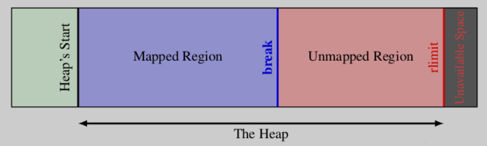
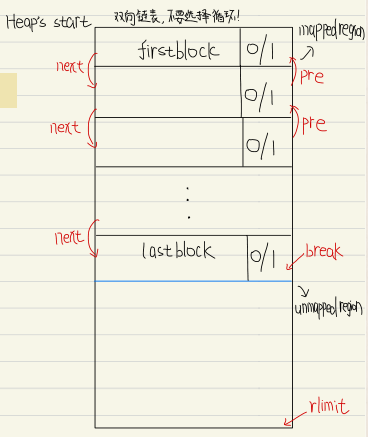
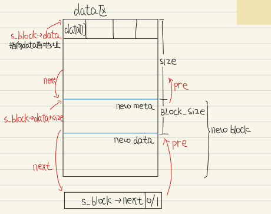
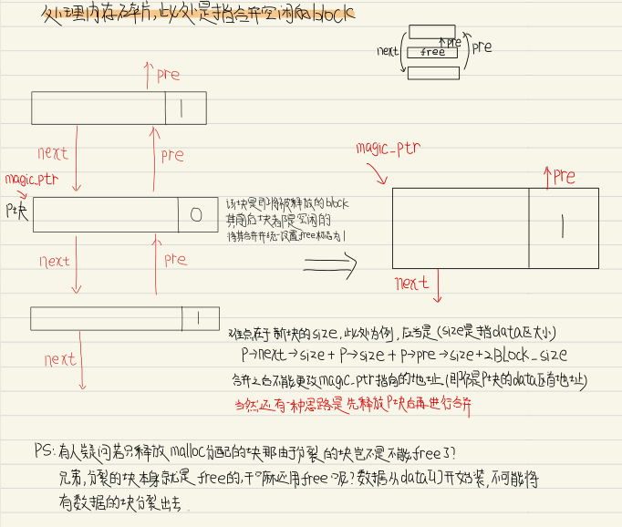
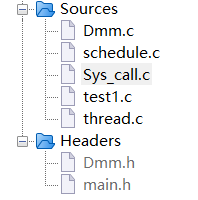
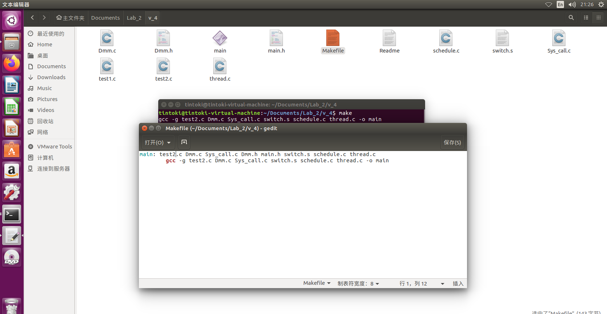
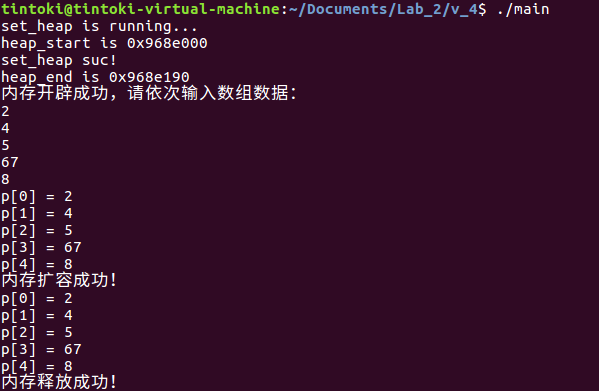
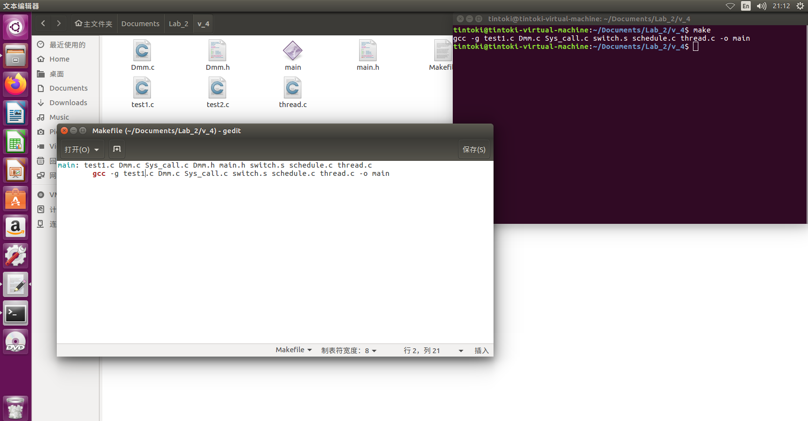
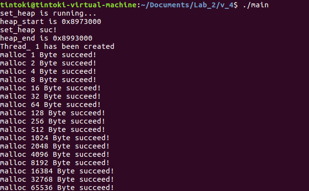

# 一、实验要求

用户态内存管理需要实现一个显式分配的动态内存分配器

1. 实现内存管理基本机制，拥有malloc和free，remalloc三个api
   - 开局向操作系统申请一片内存，之后手动管理这片内存区域
   - malloc
     - 申请一块指定大小的内存区域，这个api参数有一个，表示内存区域大小
     - 如果分配失败了，返回null
     - 如果成功了，就返回内存区域的地址
     - 如果当前分配器的内存用完了，不需要向操作系统申请新的内存
   - free
     - 销毁指定大小的内存区域，这个api的参数只有一个，表示内存区域位置
     - free的时候需要完成空闲块的合并
   - realloc
     - 改变一块已经申请内存区域的大小，这个api的参数有两个，第一个是需要改变的内存区域的地址，第二个是新的内存区域需要的大小
     - 如果分配失败了，返回null，旧的内存区域不发生改变
     - 如果成功了，就返回内存区域的地址
   - 只需要单线程支持就可以
2. 内存管理策略（以下三选一）
   - first fit，best fit，worst fit三种方法任选其一。此时采用的是链表的方法组织内存
   - 类似于Slab allocation，此时采用列表的方式组织内存
   - 类似于Buddy allocation，此时采用伙伴树的方法组织内存
3. 和lab1配合
   - 在lab1生成的一个线程中申请一块内存区域，并free掉。注意，此时只要求单线程。
   - 用户态内存库向操作系统申请128KB大小的内存，在用户态线程中用循环依次申请1，2，4，8，16...字节大小的内存，直到没有空余内存，内存库应该处理这种情况，并打出“run out of memory”的log

# 二、实验环境

本次实验使用的环境参考如下

| 环境项目     | 配置             |
| ------------ | ---------------- |
| 操作系统     | Ubuntu 16.04     |
| 操作系统位数 | 32位             |
| 开发工具     | gedit、make、gcc |
| 开发语言     | C语言            |
| 指令集架构   | X86              |
| 内存         | 4GB              |
| 处理器       | 1                |

# 三、实验内容

## 1.前置知识点

malloc并不是操作系统提供的系统调用或C的关键字，malloc仅仅只是C标准库中提供的一个普通函数；

要实现一个类malloc函数函数并不难，但是相应的效率也比不上现有的C标准库（如glibc）提供的malloc函数；

### 1.1 动态内存管理

因为我们无法提前知道程序到底需要使用多少内存，只有在程序真正运行起来的时候才知道，因此我们需要使用动态内存分配（注意malloc只能开辟，调整大小是realloc的工作）；

#### 1.1.1 malloc函数

- malloc函数会在内存的堆区申请一块空间给我们使用；

- 因此我们需要传一个int类型的值给malloc函数，这个值代表我们需要的字节个数；

- 同时malloc函数会返回一个void*类型的指针变量，我们需要将它强制类型转换成我们需要的指针变量；

例如我们需要一个int类型的长度为10的数组

```c
int *pa=(int *)malloc(10 * sizeof(int));//当然可以直接写成40
```

开辟空间不一定是成功的，失败则malloc函数返回一个空指针，我们需要对返回指针做判断

```c
if(NULL == pa){
    perror(" Null pointer! ");//报错
    return;
}
```

>- malloc分配的内存大小至少为size参数所指定的字节数；
>- malloc的返回值是一个指针，指向一段可用内存的起始地址；
>- 多次调用malloc所分配的地址不能有重叠部分，除非某次malloc所分配的地址被释放掉；
>- malloc应该尽快完成内存分配并返回（不能使用NP-hard的内存分配算法）；
>- 实现malloc时应同时实现内存大小调整和内存释放函数（即realloc和free）；

#### 1.1.2 realloc函数

如果在使用堆区的空间时，申请的空间大小是固定的，则这些空间实际上和栈区的空间没什么区别，realloc函数是整个动态内存管理的关键；

- realloc函数可以对我们之前用malloc函数或calloc函数申请的空间进行扩大或缩小；

- realloc函数需要两个参数，第一个是之前指向空间的指针变量（注：这个指针变量只能指向空间的首地址，如果传入其他指针，如数组第2个元素的地址，就会报错，因此，之前用来接收的指针变量不能轻易修改），第二个变量是修改后的空间大小；

- realloc函数返回的也是void*类型的变量，需要进行强制类型转换；

注意，当使用realloc修改完空间大小之后，数据可能就不在原来的区域上（因为很可能在原始地址上扩容会与其他空间发生冲突），因此我们需要对指向这块空间的指针变量pa进行重新赋值；

当然realloc函数也可能返回空指针，因此我们需要创建一个临时变量来存储返回的地址，先对其进行判断，如果不是空指针则将它交付给指针变量；

```c
int* tmp = (int*)realloc(pa, 20 * sizeodf(int));//将上述空间扩容为20个
if(NULL = tmp){
    perror(" ");
    return;
}
pa = tmp;
```

>realloc函数第一个参数可以传空指针，如果这么做，realloc函数作用与malloc函数相同；

#### 1.1.3 free函数

free函数用于释放我们申请的空间，只需要将空间的首地址传给free函数即可完成释放；

```c
free(pa);
```

注意，这里我们只是将这块空间释放了（简单理解就是解除了和pa指针的绑定），然而此时我们的pa指针仍然指向一块未知的区域，这是非常危险的，我们需要将该指针也设置为空

```c
pa=NULL;
```

>1.free函数可以传空指针，如果传空指针，free函数就什么都不做；
>
>2.free函数只能传由malloc和calloc开辟出的空间的首地址，传其他地址会报错；

----

> Q：到这里可能很多人会和我有一样的疑惑，C++中的new和delete为什么没有对应realloc的函数呢？意思是C++不能给申请的自由存储区扩容？

A：参考回答[(1条消息) new的空间能否用realloc扩容？_SseakomS_HK的博客-CSDN博客](https://blog.csdn.net/K_04_10/article/details/126838274)，[怎么样扩大new分配的内存？-CSDN社区](https://bbs.csdn.net/topics/70229439)

首先，千万不要尝试用realloc给new的空间扩容，对于内置类型来说可能不会出错，但是自定义类型一定会出问题；

在C++中假如尝试扩容可以选择重新new一块空间然后将数据复制过去，也可以使用指针直接在原有基础上new一部分空间，最好的方法还是使用容器这种可以自动管理内存的类；

------

### 1.2 原理剖析

我们可以认为程序运行起来后在内存中是这样的，内存的动态申请和释放都发生在堆区；


从内存分配器的角度看，不论是整数、浮点数或者链表、结构体等，通通被看作是存放在内存块中的数据，这些内存块中用于存放原生的字节序列；申请者拿到内存块之后可以塑造成各种各样的数据结构以及对象，但这与内存分配器毫无关系；

Lab_2实际上要实现的就是对堆区进行管理，主要提供三个API：malloc、free以及realloc函数；

内存从申请到释放中有以下细节需要注意；

> 细节1：申请内存时我们如何知道哪些内存块是空闲的？

这意味着我们需要将内存块使用某种方式组织起来，这样才能追踪到每一块内存的分配状态；

>细节2：在一次内存申请时可能有多个空闲内存块满足要求，应该选择哪一个空闲内存块分配给用户呢？


> 细节3：假如我们选择了32字节的空闲内存块，而用户实际只需要16个字节，剩下的字节该如何处理？

> 细节4：当分配给用户的内存使用完毕并归还给我们后，应当如何处理用户归还的内存？

#### 1.2.1 管理空闲内存块

##### (1)空闲内存块结构

这部分核心是需要某种方法区分空闲内存块和已分配内存块；

因为无法将空闲内存块的信息保存在其他地方（因为将这些信息保存在其他数据结构中意味着首先就要申请内存，这就成了一个鸡生蛋的问题），所以只能将维护内存块的分配信息保存在内存块本身中；

为了维护内存块分配状态，我们需要以下信息：

- 一个标记，用于标识该内存块是否空闲；
- 一个数字，用于记录该内存块的大小；

> 注意，在接下来的讨论中我们不可避免的会加一些限制，这些限制是为了方便理解，实际上malloc并不会存在这些限制；

方便起见，假设我们的内存分配器不对内存对齐有要求，且允许一次内存申请的最大内存块为2G，这意味着可以使用31个bit记录内存块的大小，剩下一个bit标识该内存块空闲/已分配；

我们将上述32bit作为header，用于存储块信息，剩下的真正可以用于分配给用户的内存部分被称作负载payload，调用malloc返回的内存起始地址就是负载的起始地址；


##### (2)跟踪内存分配状态

我们知道每一个内存块的结构后，就可以组织整块堆区进行内存的分配与释放


上图中，每个方框代表4字节，红色区域表示已经被分配出去，灰色区域表示该内存块空闲；

最后一个内存块比较特殊，0/1这个方框的作用就是作为一个特殊标记告知内存分配器已经到达堆区末尾；

#### 1.2.2 选择空闲内存块

当有多个空闲内存块满足要求，这就涉及分配策略；

##### (1)First Fit

最简单的就是每次从头开始找起，找到第一个满足要求的就返回；

这种方法的优势在于简单，但该策略总是从前面的空闲块找起，因此很容易在堆区前半部分因分配出内存留下很多小的内存块，因此下一次内存申请搜索的空闲块数量将会越来越多；

##### (2)Next Fit

从上一次找到合适的空闲内存块的位置找起，因为上一次找到某个合适的内存块的地方很有可能剩下的内存块能满足接下来的内存分配请求；

由于不需要从头开始搜索，因此Next Fit将远快于First Fit；

然而也有研究表明Next Fit方法内存使用率不及First Fit，也就是同样的停车场面积，First Fit方法能停更多的车；


##### (3)Best Fit

Best Fit算法会找到所有的空闲内存块，然后将所有满足要求的并且大小为最小的那个空闲内存块返回，这样的空闲内存块才是最Best的，因此被称为Best Fit；

Best Fit最大的缺点就是分配内存时需要遍历堆上所有的空闲内存块，在速度上显然不及前面两种方法；

#### 1.2.3 分配内存

现在我们来讨论这样的情况，用户申请12字节的内存，我们选择了32字节的空闲内存块，我们是将整块32字节的空闲内存块标记为已分配？这样当然速度很快，但是会造成内存碎片（指该内存块剩下的空间将无法被利用）；

一种解决方法是将空闲内存块进行划分，将前部分设置为已划分并返回给内存申请者使用，后部分划分为一块新的空闲内存块；

#### 1.2.4 释放内存

释放内存可不像free看上去那么简单，要考虑到的关键一点就在于，与被释放的内存块相邻的内存块可能也是空闲的。如果释放一块内存后我们仅仅简单的将其标志位置为空闲，那么可能会出现下面的场景：


从图中我们可以看到，被释放内存的下一个内存块也是空闲的，如果我们仅仅将这16个字节的内存块标记为空闲的话，那么当下一次申请20字节时图中的这两个内存块都不能满足要求，尽管这两个空闲内存块的总数要超过20字节；

一种更好的方法是当应用程序向我们的malloc释放内存时，我们查看一下相邻的内存块是否是空闲的，如果是空闲的话我们需要合并空闲内存块；

在这里我们又面临一个新的决策，那就是释放内存时我们要立即去检查能否够合并相邻空闲内存块吗？还是说我们可以推迟一段时间，推迟到下一次分配内存找不到满足要的空闲内存块时再合并相邻空闲内存块：

- 释放内存时立即合并空闲内存块相对简单，但每次释放内存时将引入合并内存块的开销，However，这种策略最为简单；
- 实际使用的内存分配器都会有某种推迟合并空闲内存块的策略；

当然合并内存块的故事并没有结束，考虑如下情况：


使用的内存块其前和其后都是空闲的，在当前的设计中我们可以很容易的知道后一个内存块是空闲的，因为我们只需要从当前位置向下移动16字节就是下一个内存块，但我们怎么能知道上一个内存块是不是空闲的呢？

我们之所以能向后跳是因为当前内存块的大小是知道的，那么我们该怎么向前跳找到上一个内存块呢？

思路很简单，类比于header，在内存块的末尾加上一个footer，header和footer的内容是一样的，因为上一内存块的footer和下一个内存块的header是相邻的，这样当我们释放内存时就可以快速的进行相邻空闲内存块的合并；

> 上面的实现思路都是基于数组，经过讨论我们也发现了数组并不是很适合，所以下面我们会将block的组织方式变为链表实现；

### 1.3 Linux内存简介

#### 1.3.1 heap内存模型

OS课程中已经介绍过，malloc申请的内存主要是从heap区域分配，而进程面对的是虚拟内存地址空间，这意味着只有将虚拟内存地址/页映射到真实的物理内存地址/页框才能真正使用该虚拟内存；然而受到实际物理存储容量的限制，整个堆虚拟空间是不可能全部映射到实际的物理内存的，Linux对堆虚拟空间的管理如下



简单来说，Linux维护着一个break指针，这个指针指向堆空间的某个地址：

- 从堆起始地址到break之间的虚拟地址空间为映射好的，可以供进程访问；

- 从break往上，是未映射的虚拟地址空间，如果访问这段空间则程序会报错；

Linux通过brk和sbrk系统调用来操作break指针，这两个系统调用的原型如下（`如果是严格按照实验要求来实现，这两个系统调用也需要重写`）：

```c
int brk(void *addr);
void *sbrk(intptr_t increment);
```

brk将break指针直接设置为某个地址，brk在执行成功时返回0，否则返回-1并设置errno为ENOMEM；

sbrk将break从当前位置移动increment所指定的增量，sbrk成功时返回break移动之前所指向的地址，否则返回(void *)-1；（如果将increment设置为0，则可以获得当前break的地址）

> PS：由于Linux是按页进行内存映射的，所以如果break被设置为没有按页大小对齐，系统实际上会在最后映射一个完整的页以实现页对齐，这将导致实际已映射的内存空间比break指向的地方要大一些，有人可能有疑惑说那这样break之后的一小部分不就合法可以使用了吗？理论上来说的确是可以的，但是使用break之后的地址是很危险的一件事，不要尝试！

#### 1.3.2 资源限制

进程是系统资源分配最小的单位，但系统对进程分配的资源并不是无限的，每个进程都有一个rlimit表示当前进程可用的资源的上限，rlimit是一个结构体

```c
struct rlimit {
    rlim_t rlim_cur;  /* Soft limit 软限制*/
    rlim_t rlim_max;  /* Hard limit 硬限制*/
};
//可以通过setrlimit对rlimit进行有条件设置；
//硬限制作为软限制的上限，非特权进程只能设置软限制并且不能超过硬限制；
```

可以通过系统调用getrlimit得到

```c
//获取当前进程虚拟内存空间的rlimit
int main() {
    struct rlimit *limit = (struct rlimit *)malloc(sizeof(struct rlimit));
    getrlimit(RLIMIT_AS, limit);
    printf("soft limit: %ld, hard limit: %ld\n", limit->rlim_cur, limit->rlim_max);
}
```

## 2.数据结构设计

### 2.1 block块

将堆区内存空间以block的方式组织，每个block由meta区和data区组成：

- meta区域记录了block的元信息（数据区大小、空闲标志位、指针等）；
- data区是真实分配的内存区域，data区的第一个字节地址为malloc返回的地址；

还有一点需要注意的是无论是data区还是meta区其长度都需要是8字节的整数倍，因为计算机每次读取数据都按照8字节读取；

双向链表的设计是为了实现在free的时候便于和相邻的空闲block合并；

下面给出block对应的数据结构图示和代码


```c
struct s_block{
    size_t data_size;//data区域大小，32位系统中size_t是4字节
    int is_free;     //block是否空闲标记，大小为4字节，0表示已分配，1表示空闲
    t_block pre;      //采用双向链表组织block，每个block分别有指向前一个block和指向后一个block的指针，32位的编译器指针为4字节
    t_block next;
    void *malloc_ptr;//该指针指向malloc函数返回的地址，void*在32位系统占4字节
    int meta_fill;   //填充meta区域使之长度为8的倍数
    char data[1];    //虚拟字段，表示data区的第一个字节，虚拟字段不占用字节
};
```

### 2.2 block链表

我们将多个block块以双向链表的方式组织，便于管理和创建，下面是图示



## 3.函数封装

### 3.1 malloc函数

#### 3.1.1 First Fit算法

我们将block组织成链表的形式，现在考虑如何在block链中查找并选择合适的空闲block，这里我们采用First Fit算法

```c
t_block first_find_block(t_block *last_block,size_t data_size){
    t_block current_block = (t_block)first_block;                                        //temp指针从first_block开始寻找
    while(current_block && !(current_block->is_free && current_block->data_size >= data_size)){ //终止条件为找到free块且data_size大于等于申请的data_size
        *last_block = current_block;                                                      //last_block指向block链表中的最后一个block，只有在开辟新block的时候会使用
        if(current_block->next == NULL){
            return NULL;                                                                //假如遍历完所有block后还是未能找到合适的block，则返回NULL
        }
        else{
            current_block = current_block->next;
        }
    }
    return current_block;
}
```

#### 3.1.2 开辟block

当现有的空闲block都不满足用户申请的size要求，就需要在block链最后开辟一个新的block，这里借助了系统调用sbrk

```c
t_block add_block(t_block last_block,size_t data_size){
    t_block new_block;
    t_block break_add = (t_block)heap_sbrk(0);           //获取当前break指针的地址
    if(heap_sbrk((size_t)(BLOCK_SIZE+data_size))==NULL){
        return NULL;                               //使用sbrk开辟新块，并判断是否开辟成功，失败则返回NULL
    }
    new_block = break_add;                          //配置新块的信息
    new_block->data_size = data_size;
    new_block->next = NULL;
    new_block->is_free = 1;
    if(last_block){                                //last_block实际上可能是NULL，需要先判断
        last_block->next = new_block;
        new_block->pre = last_block;
    }
    return new_block;
}
```

#### 3.1.3 分裂block

为了提高payload，应该在剩余data区足够大的情况下（我们规定剩余空间至少有BLOCK_SIZE + 8才执行分裂操作，因为默认8字节对齐）将其分裂为新的block；



```c
void break_block(t_block current_block,size_t data_size){
    t_block new_block = (t_block)(current_block->data+data_size);    //block指针跨过前一个块的整个data区
    new_block->data_size = current_block->data_size-data_size-BLOCK_SIZE; //设置新的data区大小（注意size是不包含meta区的）
    new_block->is_free = 1;
    new_block->pre = current_block;
    new_block->next = current_block ->next;
    current_block->next = new_block;
    current_block->data_size = data_size;
}
```

#### 3.1.4 字节对齐

我们希望malloc分配的数据区是按8字节对齐，所以在size不为8的倍数时，我们需要将size调整为大于size的最小的8的倍数；

```c
size_t align8(size_t s) {
        if(s & 0x7 == 0)
	    return s;
	return ((s >> 3) + 1) << 3;
 }
```

#### 3.1.5 实现malloc

```c
void *malloc(size_t data_size){
    t_block current_block,last_block;
    size_t align_size = align_8(data_size);
    if(first_block){                                             //1.如果链表不为空，也就是已经在堆区开辟了部分空间，等价于firstblock不为空
        last_block = (t_block)first_block;                       //初始化last_block指针
        current_block = first_find_block(&last_block,align_size);//使用first fit算法
        if(current_block){                                       //1.1 假如找到合适的block块，判断是否可以进行分裂
            if((current_block->data_size-align_size)>=(BLOCK_SIZE+8)){
                break_block(current_block,align_size);
            }
            current_block->is_free = 0;
        }
        else{                                                    //1.2 假如没有找到合适的block块则需要申请
            current_block = add_block(last_block,align_size);
            if(current_block==0){                                //假如申请失败则返回NULL
                return NULL;
            }
        }
    }
    else{                                                        //2.如果链表是空的，那么就把该block作为链表的头部
        current_block = add_block(NULL,align_size);
        if(current_block==0){
            return NULL;
        }
        first_block = current_block;
    }
    current_block->malloc_ptr = current_block->data;
    return current_block->data;                                  //返回data区的首地址
}
```

### 3.2 free函数

free需要解决两个关键的问题：

1. 如何验证所传入的地址是有效地址，即确实是通过malloc方式分配的数据区首地址
   - 地址应该在之前malloc所分配的区域内，即在first_block和当前break指针范围内 —— 进行地址比较
   - 这个地址确实是之前通过我们自己的malloc分配的 —— magic pointer（s_block->data指向的是data区首地址，magic pointer指向的也是data区首地址？？在一般情况下两者是等价的，但是在中途如果分裂了block则会有两个s_block->data但是仍然只有一个magic pointer）
2. 如何解决碎片问题

#### 3.2.1 获取meta地址

该函数的作用是通过传入的data区首地址反向获取对应的meta去首地址，进而获得其malloc_ptr

```c
t_block get_meta_add(void *data_add){
    data_add = data_add - BLOCK_SIZE;
    //printf("%p\n",data_add);
    return (t_block)data_add;
    //return (data_add = temp -= BLOCK_SIZE);
}
```

#### 3.2.2 判断data地址

通过判断用户输入的data区首地址和实际malloc分配的data区首地址是否相等来决定是否free

```c
int judge_add(void *data_add){
    if(first_block){
        if(data_add>first_block && data_add<heap_sbrk(0)){               //如果传递进来的地址在堆的可映射合法空间
        //printf("com suc");
        //printf("%p\n",data_add);
        //printf("%p\n",get_meta_add(data_add)->malloc_ptr);
        return data_add == get_meta_add(data_add)->malloc_ptr;      //查看传进来的地址和malloc申请空间时设置的数据区地址是否相等
        }
    }
    //printf("com fail");
    return 0;
}
```

#### 3.2.3 合并block

free的block块其前后若有同样free的块，我们进行合并操作，这样可以避免无法满足一些较大的申请块的申请；



```c
t_block merge_block(t_block data_add){
    if(data_add->next && data_add->next->is_free){                     //如果要释放的一块的后面有一个已经分配过的块，但还是空闲的（我们这里实现的是向后合并）
        data_add->data_size = data_add->data_size+BLOCK_SIZE+data_add->next->data_size;
        data_add->next = data_add->next->next;
        if(data_add->next){                                         //此时的data_add->next已经是第三个块了
            data_add->next->pre = data_add;
        }
    }
    return data_add;
}
```

#### 3.2.4 实现free

free的思路如下：

- 首先检查参数地址的合法性；如果不合法则不做任何事；否则，将此block的free标为1，并且在可以的情况下与后面的block进行合并；
  - 如果当前是链表的最后一个block，则回退break指针释放进程内存（修改break的值）；
  - 如果当前block是最后一个block，则回退break指针并设置first_block为NULL；

```c
void free(void *data_add){
    t_block ptr;
    if(judge_add(data_add)){
       //printf("free judge suc\n");
        ptr = get_meta_add(data_add);
        ptr->is_free = 1;
        if(ptr->pre && ptr->pre->is_free){                     //1.假如前一个block存在，且是free的，则将前一个block和当前block合并
            ptr = merge_block(ptr->pre);
        }
        else if(ptr->next){                                 //2.假如后一个block存在，则使用merge_block判断并合并
            merge_block(ptr);
        }
        else{
            if(ptr->pre){                                   //3.这种情况是尽管前一个block存在，但是并不是free的
                ptr->pre->next = NULL;                      //将指针置NULL即可，不要合并
            }
            else{                                           //4.这种情况是这个block是整个堆空间最后一个还未被free的block
                first_block = NULL;
            }
            heap_brk(ptr);                                        //之所以将3和4情况合并是因为这两种情况下都需要将最后的break指针重新定位
        }
    }
    else{
    printf("内存释放失败！");
    }
}
```

### 3.3 realloc函数

#### 3.3.1 复制数据

为了实现realloc，首先要实现一个内存复制方法，为了效率，以8字节为单位进行复制（通过新建一个size_t指针，将内存区域强制看做size_t类型来实现）；

之所以要实现这个函数是为了应对现有的block不能满足扩容需求而新申请block的需求；

```c
void copy_data(t_block old_block,t_block new_block){
    size_t *old_data, *new_data;
	size_t i;
	old_data = (size_t *)old_block->malloc_ptr;
	new_data = (size_t *)new_block->malloc_ptr;
	for(i = 0; (i * 8) < old_block->data_size && (i * 8) < new_block->data_size; i++)
		new_data[i] = old_data[i];
}
```

#### 3.3.2 实现realloc

实现realloc可以直接无脑malloc新的内存再将数据复制过去（类似于C++中的一种扩容方法），更加高效的方法是考虑如下情况：

- 如果当前block的数据区大于等于realloc所要求的size，则不做任何操作
- 如果新的size变小了，考虑split
- 如果当前block的数据区不能满足size，但是其后继block是free的，并且合并后可以满足，则考虑做合并

```c
void *realloc(void *data_add,size_t data_size){
    size_t align_size;
    t_block new_block,old_block;
    void *new_ptr;
    if(!data_add){                          //1.如果首地址都是空的直接使用malloc申请一个新的block
        return malloc(data_size);
    }
    if(judge_add(data_add)){                //与free同理，relloc只能在malloc返回的地址上进行操作
//printf("judge suc");
align_size = align_8(data_size);
        old_block = get_meta_add(data_add);
        if(old_block->data_size > align_size){   //2.如果原有的空间已经大于需要重新分配的空间，意味着需要缩小空间
            if(old_block->data_size-align_size >= (BLOCK_SIZE+8)){
                break_block(old_block,align_size);
            }
        }

        else{                                   //3.扩容
            if(old_block->next && old_block->is_free){     //3.1 检查后面的block是否能满足要求
                if((old_block->data_size+BLOCK_SIZE+old_block->next->data_size)>=align_size){//如果加上后面的空间满足要求大小
                    merge_block(old_block);
                    if(old_block->data_size-align_size>=(BLOCK_SIZE+8)){                     //在满足自身要求的同时还有可以分裂的空间
                        break_block(old_block,align_size);
                    }
                }
            }
            else{                                       //3.2 后面的block不能满足要求，则只能重新malloc区域然后赋值
                new_ptr = malloc(data_size);
                if(!new_ptr){
                //printf("first fail");
                    return NULL;
                }
                new_block = get_meta_add(new_ptr);
                copy_data(old_block,new_block);
                free(old_block);
                return new_ptr;
            }
        }
    return data_add;
    }
    //printf("last fail");
    return NULL;
}
```

### 3.4 系统调用

Lab_2是有一个限制在题干中的，要求开局向操作系统申请一片内存，之后手动管理这片内存区域，这就意味着实际上是要求我们做出如下模型的


相信很多人也发现了在上面我们实现malloc、free以及realloc函数的时候使用的并不是C库提供的sbrk函数和brk函数，而是自定义的heap_sbrk和heap_brk，该模型的实现原理也很简单，因为是在mapped region中操作，因此不需要额外的系统调用，我们的目的主要分为三个：

- 开局申请一块mapped region；
- 实现heap_brk函数，功能是直接设置heap_break指针为某个合法地址；
- 实现heap_sbrk函数，功能是将当前heap_break从当前位置移动increment的增量并返回原有heap_break地址；

根据C对brk以及sbrk系统调用的描述，以及我们自定义的heap_break指针，我们可以较容易的实现，代码如下

```c
void set_heap(size_t heap_size){        //开局申请一块内存用于我们自由管理
    printf("set_heap is running...\n");
    heap_start = (t_block)sbrk(0);
    printf("heap_start is %p\n",heap_start);
    heap_break = heap_start;            //初始化全局变量heap_break
    if(sbrk(heap_size)==(void*)-1){
        printf("Error:set_heap fail!\n");
        return;
    }
    else{
        printf("set_heap suc!\n");
        heap_end = (t_block)sbrk(0);
        printf("heap_end is %p\n",heap_end);
    }
}
```

```c
int heap_brk(void *heap_addr){    //类brk函数实现
    if(heap_start<=(t_block)heap_addr&&(t_block)heap_addr<=(t_block)heap_end){
        heap_break = heap_addr;
        return 0;
    }
    else{
        return -1;
    }
}
```

```c
void *heap_sbrk(size_t heap_inc){ //类sbrk函数实现
    if(heap_start<=(t_block)((size_t *)heap_break+heap_inc)&&(t_block)((size_t *)heap_break+heap_inc)<=(t_block)heap_end){
        heap_break = (t_block)((size_t *)heap_break+heap_inc);
        return (t_block)((size_t*)heap_break-heap_inc);
    }
    else{
        return NULL;
    }
}
```

## 4.模块设计

除了原有Lab_1的文件，我们新增了两个源文件和一个头文件，整体文件树结构如下



Dmm.c中包含了malloc函数、free函数以及realloc函数的实现；

Sys_call.c包含了类系统调用三个函数的实现；

Dmm.h中声明了所需头文件以及block数据结构以及函数声明；

## 5.程序测试

Lab_2主要分为两个测试：

- 在lab1生成的一个线程中申请一块内存区域，并free掉。注意，此时只要求单线程。
- 用户态内存库向操作系统申请128KB大小的内存，在用户态线程中用循环依次申请1，2，4，8，16...字节大小的内存，直到没有空余内存

### 5.1 基本函数测试

首先我们单线程测试malloc、realloc以及free函数的正确性，编译test2.c以及相关文件



其中test2.c内容如下

```c
#include"Dmm.h"

int main()
{
        set_heap(100*sizeof(int));
        //printf("main is running...\n"); //if we add this annotate,our program will fail
	int* p = (int*)malloc(10 * sizeof(int));
	if (p == NULL)
	{
		printf("内存开辟失败！\n");
	}
	else
	{
		printf("内存开辟成功，请依次输入数组数据：\n");
		for(int i = 0; i <= 4; i++){
            scanf("%d",&p[i]);}
        for(int i = 0; i <= 4; i++){
            printf("p[%d] = %d\n", i,p[i]);}

		int *ptr = (int*)realloc(p,5*sizeof(int));
		if(ptr!=NULL){
            ptr=p;
            p=NULL;
            printf("内存扩容成功！\n");
            for(int i = 0; i <= 4; i++){
                printf("ptr[%d] = %d\n", i,ptr[i]);}

		}
		else{
            printf("内存扩容失败！\n");
		}
		free(ptr);
        ptr=NULL;
		printf("内存释放成功！\n");
	}
	return 0;

}
```

原理很简单，当然我们也可以使用C库提供的malloc、realloc以及free函数验证；

首先我们全局申请一块较大的内存用于自由管理，接着使用malloc为长度为10的数组申请一块空间，分别输入数组元素，接着我们将数组的长度realloc为5（注意realloc并不是必须要扩大容量，缩小容量同样是可以的），此时我们为了避免指针原本指向的区域变动引起错误，将ptr指针指向的地址赋值给p指针并释放ptr指针，最后释放p指针指向的区域并令p指针为NULL；

程序运行结果如下，我们的数组申请成功后分别输入2,4,5,67以及8，在realloc之后发现数据仍然正确，接着我们将其free掉；



### 5.2 线程申请测试

我们申请128KB大小的内存，使用一个循环依次申请内存直到没有空余内存，test1.c源文件如下

```c
#include"Dmm.h"
#include"main.h"
extern struct thread_struct *current;         
extern struct thread_struct *task[THR_TASKS]; 
//In this program,we test thread rather than scanf(beacause it has something wrong...)

void fun1()
{ 
    int i = 1;
    while (1)
    {
        int* p = (int*)malloc(i * sizeof(char));
	if (p == NULL)
	{
	    printf("ran out of memory！\n");
            return;
	}
	else
	{
	    printf("malloc %d Byte succeed!\n",i);
	}
        i=i*2;
        mysleep(1);
    }
}

int main()
{       
        set_heap(32768*sizeof(int));//we should note that our thread also need heap memory,so we can't calculate memory presicely
        //printf("main is running...\n"); //if we add this annotate,our program will fail
        
    	int tid1;
    	thread_create(&tid1, fun1);
    	printf("Thread_ %d has been created\n", tid1);
    	thread_join(tid1);
	
        return 0;

}

```



基本原理非常简单，首先在main主函数中申请一块内存，接着创建线程1并使用while循环一直申请内存直到没有剩余内存，运行结果如下

- 需要注意的是我们创建的线程同样是占用了开局申请的内存中的空间的；
- 同时开局申请的内存大小是以4Byte为单位，与128KB进行换算的时候需要注意；



