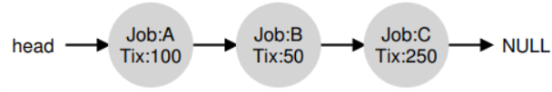
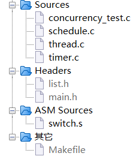
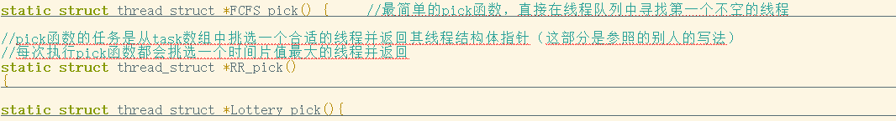
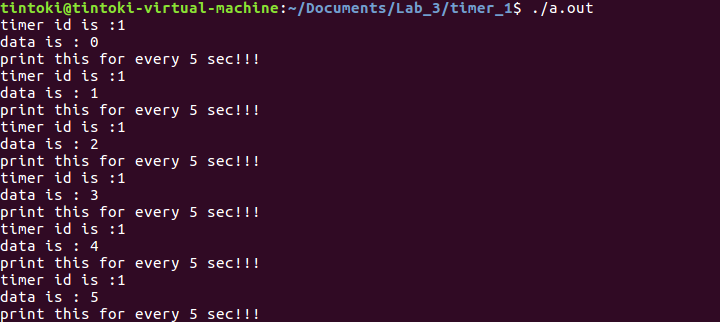
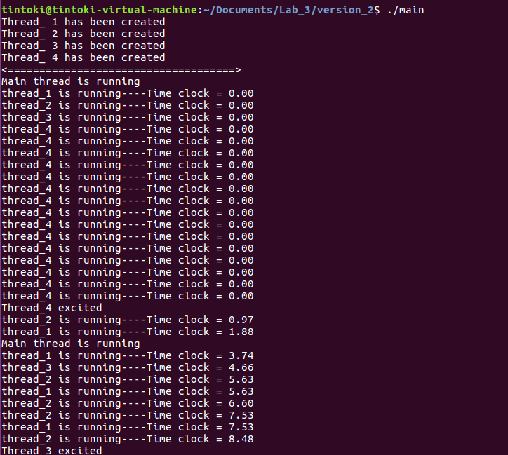
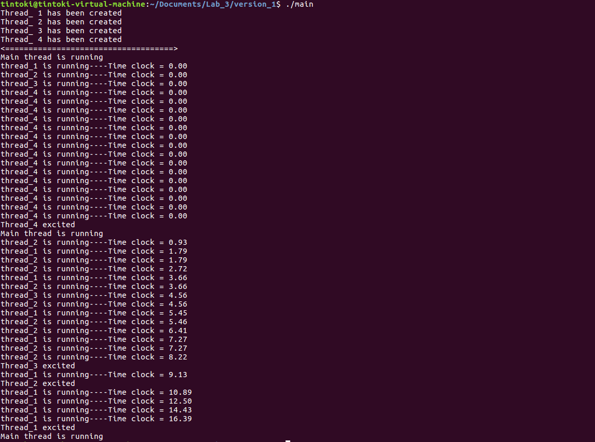
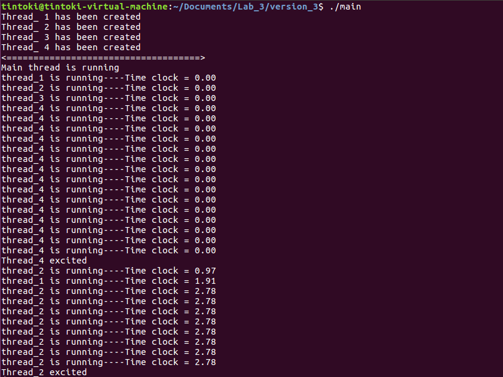

# 一、实验要求

在lab1中，我们拥有了用户态线程库，但是驱动我们进行线程管理的动力是我们在线程里面显示调用schedule函数，而操作系统往往是采用时钟tick来管理线程，在这个lab中，我们会让大家首先实现tick机制，然后继承多种调度策略

1. 实现定时器的机制，作为tick和给线程提供定时能力的基础；
   - 定时器结构体需要自己手写，不能采用现成的定时器，表示时间相关的结构体可以采用现成的库；
   - 定时器的相关接口最少需要有create_timer、start_timer、stop_timer、delete_timer的api接口；
   - 需要借助外部机制通知定时器到期，但是不能借助外部机制完成处理定时器handler、组织管理定时器的任务；
   - 组织定时器队列的数据结构、定时器的类型、定时器的时钟源不做要求；
   - 需要考虑定时器过期的情况；
2. 在定时器的基础上产生tick作为驱动线程调度的动力，并实现相关调度策略
   - 采用tick机制改写lab1中的多线程管理，不在线程里面调用schedule机制；
   - tick的间隔时长自定义；
   - 实现FIFO，RR，彩票调度算法；
   - 注意在关键的代码段，防止时钟进入；

# 二、实验环境

本次实验使用的环境参考如下

| 环境项目     | 配置             |
| ------------ | ---------------- |
| 操作系统     | Ubuntu 16.04     |
| 操作系统位数 | 32位             |
| 开发工具     | gedit、make、gcc |
| 开发语言     | C语言            |
| 指令集架构   | X86              |
| 内存         | 4GB              |
| 处理器       | 1                |


# 三、实验内容

## 1.前置知识点

### 1.1 定时器实现

#### 1.1.1 setitimer概述

在linux c编程中，setitimer是一个比较常用的函数，可用来实现延时和定时的功能，因此我们这里考虑使用setitimer函数来实现一个简单的定时器；

首先我们简单介绍一下setitimer这个函数，在使用的时候需要引入头文件

```c
#include <sys/time.h>
```

setitimer函数原型如下

```c
int setitimer(int which, const struct itimerval *new_value,struct itimerval *old_value);
```

其中which参数表示类型，可选的值有：

- ITIMER_REAL：以系统真实的时间来计算，它送出SIGALRM信号；

- ITIMER_VIRTUAL：以该进程在用户态下花费的时间来计算，它送出SIGVTALRM信号；

- ITIMER_PROF：以该进程在用户态下和内核态下所费的时间来计算，它送出SIGPROF信号；

new_value和old_value均为itimerval结构体，itimerval结构体定义如下，itimeval由两个timeval结构体组成

```c
struct itimerval {
    struct timeval it_interval; /* next value */
    struct timeval it_value;    /* current value */
};
```

timeval结构体包含tv_sec和tv_usec两部分，其中tv_se为秒，tv_usec为微秒

```c
struct timeval {
    time_t      tv_sec;         /* seconds */
    suseconds_t tv_usec;        /* microseconds */
};
```

参数总结如下：

- new_value参数用来对计时器进行设置；
- it_interval为计时间隔；
- it_value为延时时长；
- old_value参数，通常用不上，设置为NULL，它是用来存储上一次setitimer调用时设置的new_value值；

settimer工作机制是，先对it_value倒计时，当it_value为零时触发信号，然后重置为it_interval，继续对it_value倒计时，一直这样循环下去；基于此机制，setitimer既可以用来延时执行，也可定时执行；

需要注意的是若it_value为0是不会触发信号的，所以要能触发信号，it_value需要设置为大于0；如果it_interval为零，只会延时，不会定时（也就是说只会触发一次信号)；

#### 1.1.2 定时器概述

无论是用户态程序还是内核态程序的开发，大多数时候都需要有定时器的支持，定时器属于程序开发中最基本的组件之一，一般按照使用场景分为如下两种类型：

1.Single-Shot Timer：从注册到终止只执行一次；

2.Repeating Timer：在每次执行完以后，自动重新开始；

本质上，可以认为 Repeating Timer 是在 Single-Shot Timer 终止之后，再次注册到定时器系统里的 Single-Shot Timer；

Linux定时器主要有两种，第一种是2.4内核版本的，也就是我们上面介绍的itimerval结构体和setitimer api，setitimer 能够在 timer 到期之后，自动再次启动自己，因此，用它来解决 Single-Shot Timer 和 Repeating Timer 的问题较简单；

另一种是2.6内核版本的，新增了POSIX timer的API，这也是我们要模拟自定义的版本（需要注意的是，POSIX timer 接口支持在一个进程中同时拥有多个定时器实例，但POSIX timer 接口只在进程环境下才有意义 ，并不适合多线程环境）

```c
int timer_create(clockid_t clockid, struct sigevent *evp,timer_t *timerid); 									//创建了一个定时器
int timer_settime(timer_t timerid, int flags, const struct itimerspec *new_value, struct itimerspec * old_value);   //启动或者停止一个定时器
int timer_gettime(timer_t timerid, struct itimerspec *curr_value); 											    //返回到下一次到期的剩余时间值和定时器定义的时间间隔
int timer_getoverrun(timer_t timerid); 																          //返回上次定时器到期时超限值
int timer_delete(timer_t timerid);																			 //停止并删除一个定时器
```

最重要的接口是timer_create，其参数介绍如下：

- clockid 表明了要使用的时钟类型，在 POSIX 中要求必须实现 CLOCK_REALTIME 类型的时钟；
- evp 参数指明了在定时到期后，调用者被通知的方式；
- sigev_notify 指明了通知的方式：
  - SIGEV_NONE：当定时器到期时，不发送异步通知，但该定时器的运行进度可以使用 timer_gettime监测；
  - SIGEV_SIGNAL：当定时器到期时，发送 sigev_signo 指定的信号；
  - SIGEV_THREAD：当定时器到期时，以 sigev_notify_function 开始一个新的线程。该函数使用 sigev_value 作为其参数，当 sigev_notify_attributes 非空，则指定该线程的属性。注意，由于 Linux 上线程的特殊性，这个功能实际上是由 glibc 和内核一起实现的；
  - SIGEV_THREAD_ID (Linux-specific)：仅推荐在实现线程库时候使用，如果 evp 为空的话，则该函数的行为等效于：sigev_notify = SIGEV_SIGNAL，sigev_signo = SIGVTALRM，sigev_value.sival_int = timer ID

### 1.2 调度算法

#### 1.2.1 彩票调度算法

因为我们对FIFO以及RR算法都比较熟悉，所以这里我们仅介绍彩票调度算法；

彩票调度的基本思想是：一开始的时候给每个进程发彩票（优先级越高，发的彩票越多），然后每隔一段时间（一个时间片），举行一次彩票抽奖，抽出来的号是谁的，谁就能运行；

假如有两个进程A和B，调度器想让A占用80%的 CPU 时间，B占用20%的CPU时间，调度器就给A发80张彩票，给B发20张彩票；这样，每次抽奖的时候，A就有80%的概率占用CPU，从数学期望上讲，1秒钟之内，A能运行800ms；

实际上彩票调度并没有在CPU调度程序里广泛使用，一个原因是不能很好的适合I/O，另一个原因是票数分配问题没有确定的解决方式，比如新打开了一个浏览器进程，那该给它分配多少票？票数少了，响应跟不上，票数多了，又会浪费 CPU时间；

彩票调度的实现非常简单，只需要使用一个随机数生成器选择中奖彩票、一个记录系统中所有进程的数据结构、所有彩票的总数；

这里我们简单举个例子来说明，假设我们使用列表记录进程，下面进程A、B、C分别持有一定数量的彩票



在做出调度决策之前需要先从彩票总数400中选择一个随机数，假设是300，然后遍历链表，借助一个计数器帮助我们找到该数字；

从前向后遍历进程列表，将每张票的值加到couter上，直到所有的值超过winner，此时当前列表对应的进程就是中奖进程；

本例中，中奖彩票是300。首先，计A的票后，counter增加到100。因为100小于300，继续遍历。然后counter会增加到150（B的彩票），仍然小于300，继续遍历。最后，counter增加到400（显然大于300），因此退出遍历，current指向C（中奖者）；

## 2.数据结构设计

### 2.1 线程结构体

在Lab_1中我们大致介绍过，整个程序的主要函数及其功能如下：

1. 通过调用thread_create函数(这个是自己写的函数，不是pthread_create)创建线程；
2. 通过两种方式启动线程：
   - 调用函数detach实现线程的分离式启动（父线程不必等待子线程执行结束，可以继续执行）；
   - 调用函数thread_join实现阻塞式启动（父线程等待该子线程结束后才能继续执行）；
3. 线程的状态转换：通过一系列的线程状态函数实现线程的状态转换
4. 线程切换：线程的切换方式有两种：
   - 主动切换my_sleep：调用schedule切换到指定线程，并在一段时间后wakeup可调度；
   - 时钟中断切换do_timer：通过设置时钟中断，中断后执行schedule函数来完成；
5. 线程调度pick：采用时间片轮转调度算法，根据线程优先级为每个线程设置时间片；

本次实验我们详细介绍如何实现tick机制以及实现FIFO、RR和彩票调度算法（即线程调度部分）；

可以将tick理解为嘀嗒，也就是对时间的粗粒度化，我们可以任意规定一个tick的大小，此处我们假设一个tick为10ms，之所以要介绍tick是因为它作为时间片的基本单位，比如我们规定我们程序中使用的时间片的大小为15个tick，这就意味着线程的一个时间片换算为时间为150ms；

因为我们引入了时间片的概念，所以需要将时间片引入线程结构体，后面我们还引入了彩票调度算法，所以这里还引入了彩票数量

```c
struct thread_struct {
  int id;                                       //线程标识符
  void (*thread_func)();                        //指向线程过程函数的函数指针，用来记录线程执行的函数
  int esp;                                      //stack的栈顶指针
  unsigned int wakeuptime;                     //线程唤醒时间
  int status;                                   //线程状态
  int counter;                                  //时间片数量
  int priority;                                 //线程优先级
  int stack[STACK_SIZE];                        //线程运行栈
  int tickets;                                  //彩票数量
};
```

要实现时间中断的原理非常简单，系统在每个tick中产生一个时钟中断并进入时钟中断处理函数do_timer，在do_timer中让线程的时间片值减1直到0，执行schedule函数；

难点在于如何使do_timer时间中断函数在每个嘀嗒数知道自己应当自动执行，这里借助了Linux中的signal机制，使用函数 setitimer 每隔 10 ms 发送一次信号 SIGALRM，然后捕捉此信号；

```c
//基于时间中断的调度
//基本思想是系统在每个嘀嗒中产生一个时钟中断并进入时钟中断处理函数do_timer，在do_timer中让线程的时间片值减1直到0，执行schedule函数
//此处可以使用linux的信号机制，使用函数setitimer每间隔10ms（此处设一个嘀嗒为10ms）发送一次信号SIGALRM然后捕捉该信号即可
__attribute__((constructor))   //修饰，使得该函数能够在main函数之前执行
static void init()
{
    struct itimerval value;
    value.it_value.tv_sec = 0;                      //it_value为延时时长，1000us等于1ms
    value.it_value.tv_usec = 1000;
    value.it_interval.tv_sec = 0;                   //it_interval为计时间隔.1000*10us等于10ms
    value.it_interval.tv_usec = 1000 * 10;
    if (setitimer(ITIMER_REAL, &value, NULL) < 0)
    {
        perror("setitimer");
    }
    signal(SIGALRM, do_timer);
}
```

当然上述想法只是最简单的一种方式，我们这个实验要求的是具备至少有create_timer、start_timer、stop_timer和delete_timer的定时器，所以我们需要基于系统提供的settimer函数对定时器进行设计和实现；

至于我们要实现的FIFO、RR以及彩票调度算法都是基于tick机制（也就是上面实现的定时器）对pick函数的修改；

### 2.2 定时器队列

该队列主要用于装入定时器，被装入定时器队列中的定时器会start且开始执行传入的回调函数

```c
struct timer_list{
	struct list_head head;
	int num;
	int size;
	void (*sighandler_old)(int);
	void (*sighandler)(int);
	struct itimerval ovalue;
	struct itimerval value;
};
```

### 2.3 定时器结构体

主要设计如下，包含了使用到的时间间隔、定时器数量、回调函数、用户数据以及定时器id；

```c
typedef struct timer{
	struct list_head node;
	int interval; /*timer interval(second)*/
	int elapse;   /*timer count*/
	callback cb;  /*call back function*/
	void *user;   /*user data*/
	int len;
	int id;       /*timerid*/
}timer_node_t;
```

## 3.函数封装

### 3.1 定时器的实现

主要定义了如下结构体和函数指针

```c
typedef void (*callback)(int id, void *data, int len);  //给void(*)(int id, void *data, int len)函数指针定义别名callback
typedef void (*SIG_FUNC)(int signo);                    //给void (*)(int signo)函数指针定义别名SIG_FUNC
```

```c
//timer_node_t作为struct timer的别名
typedef struct timer{
	struct list_head node;
	int interval;		 	/*timer interval(second)*/
	int elapse;  		 	/*timer count*/
	
	callback cb; 			/*call back function*/
	void *user;  			/*user data*/
	int len;
	int id; 				/*timerid*/
}timer_node_t;
```

```c
struct timer_list{
	struct list_head head;
	int num;
	int size;
	void (*sighandler_old)(int);
	void (*sighandler)(int);
	struct itimerval ovalue;
	struct itimerval value;
};
```

接着定义如下函数

```c
static void sig_func(int signo) ;
```

timer队列创建函数，等同于create_timer

```c
/**
*Create timer list
*@param
*/
struct timer_list *create_timer_list(int count) ;
```

添加timer计时器进入timer队列，等同于start_timer

```c
/*
* Add a timer to timer list.
*
* @param interval  The timer interval(second).
* @param cb When cb!= NULL and timer expiry, call it.
* @param user_data Callback's param.
* @param len The length of the user_data.
*
* @return if == -1, add timer fail.
*/
int  add_timer(int interval, callback cb, void *user_data, int len) ;
```

将timer队列中的指定timer_id的计时器删除，停止该timer工作，等同于stop_timer

```c
int  del_timer(int timer_id);
```

将整个timer队列删除，等同于delete_timer

```c
/*
* Destroy the timer list.
*
* @return 0 means ok, the other means fail.
*/
int destroy_timer(struct timer_list *list);
```

使用定时器的方式也很简单，我们只需要依次调用create_timer_list创建timer队列、使用add_timer加并启动入计时器，计时器使用完毕后调用del_timer删除计时器，最后销毁整个timer队列并结束整个进程；

主要的难点在于将定时器提供的API接口和调度算法结合，我们将在下面讨论；

### 3.2 调度算法实现 

#### 3.2.1 FIFO调度算法

该调度算法也被称为先进先出算法，需要注意的是和先来先服务算法FCFS做区别：

- FIFO：按照时间片轮转方式运行，分给每个进程的时间一样，若正在运行的进程在一个时间片内已经完成，则激活调度程序，此时调度就绪队列排在队首的进程运行；若在一个时间片内进程没有运行完，就将它送到就绪队列的末尾，等待下一个时间片再执行；
- FCFS：对每个进程都比较公平FCFS算法就是调度最先进入就绪队列的进程，不考虑时间长短，比如A进程执行30min，B进程执行10s，此时B进程就必须等30min；

很多人可能会有疑问，FIFO明明是页面置换算法，和进程调度八竿子打不着...其实这里是因为在某些教材中将FCFS也称作FIFO，简单来说就是让我们实现FCFS（稍微动动脑子也知道Lab_3怎么可能让我们去做内存相关）；

对FIFO调度的实现如下，因为线程都是按照顺序进入线程队列中的，所以只需要考虑从当前线程往后寻找一个非空的线程即可；

```c
static struct thread_struct *FIFO_pick() {    
    int current_id  = current->id;
    int i;
    struct task_struct *next = NULL;
repeat:
    for (i = 0; i < THR_TASKS; ++i) {
        if (task[i] && task[i]->status == THREAD_STATUS_SLEEP) {
            if (getmstime() > task[i]->wakeuptime)
            task[i]->status = THREAD_STATUS_RUNNING;
        }
    }
    i = current_id;
    while(1) {				// 寻找下一个不空的线程
    i = (i + 1) % THR_TASKS;
    if (i == current_id) {
    // 循环了一圈说明没找到可被调度的线程，重新计算线程是否可被唤醒
        goto repeat;
    }
    if (task[i] && task[i]->status == THREAD_STATUS_RUNNING) {
        next = task[i];
        break;
    }
    }
  return next;
}
```

#### 3.2.2 RR调度算法

RR调度算法的基本思想就是每次执行调度函数的时候都会在线程队列中挑选一个时间片counter最大的线程运行，也就是遍历所有THREAD_STATUS_RUNNING的线程并找到其中couter值最大的线程进行返回；

存在的一个问题是假如所有的THREAD_STATUS_RUNNING的线程的时间片都是0，则该调度函数会重新为所有的线程设置couter；

下面的RR调度算法对于THREAD_SLEEP的任务优先级设置很高，这意味着THREAD_SLEEP的线程一旦进入THREAD_RUNNING状态就会被优先投入运行；

```c
static struct thread_struct *RR_pick()
{
    int i, next, c;
    for (i = 0; i < THR_TASKS; ++i)
    {
        if (task[i] && task[i]->status != THREAD_STATUS_EXIT && getmstime() > task[i]->wakeuptime)
        {
            task[i]->status = THREAD_STATUS_RUNNING;
        }
    }
    while (1)
    {
        c = -1;
        next = 0;
        for (i = 0; i < THR_TASKS; ++i)
        {
            if (!task[i])
                continue;
            if (task[i]->status == THREAD_STATUS_RUNNING && task[i]->counter > c)
            {
                c = task[i]->counter;
                next = i;
            }
        }
        if (c)
            break;
        if (c == 0)
        {
            for (i = 0; i < THR_TASKS; ++i)
            {
                if (task[i])
                {
                    task[i]->counter = task[i]->priority + (task[i]->counter >> 1);
                }
            }
        }
    }
    return task[next];
}
```

#### 3.2.3 彩票调度算法

彩票调度算法的基本思想和原理也不难，我们在前置知识点部分已经介绍过，一个实现的伪代码如下，且给出了注释

```c
// counter: used to track if we've found the winner yet
int counter = 0;

// winner: use some call to a random number generator to get a value, between 0 and the total # of tickets
int winner = getrandom(0, totaltickets);

// current: use this to walk through the list of jobs
node_t *current = head;

// loop until the sum of ticket values is &gt; the winner
while (current) {
  counter = counter + current->tickets;
  if (counter < winner) break;  // found the winner
  current = current->next;
}  // 'current' is the winner: schedule it...
```

因为我们为线程分配了彩票所以需要拓展结构体

```c
struct thread_struct {
  int id;                                       //线程标识符
  void (*thread_func)();                        //指向线程过程函数的函数指针，用来记录线程执行的函数
  int esp;                                      //stack的栈顶指针
  unsigned int wakeuptime;                     //线程唤醒时间
  int status;                                   //线程状态
  int counter;                                  //时间片数量
  int priority;                                 //线程优先级
  int stack[STACK_SIZE];                        //线程运行栈
  int tickets;                                  //彩票数量
};
```

在初始化线程的时候随机分配彩票数量（这里我们做了简化，固定分配彩票数量）

```c
int thread_create(int *tid, void (*start_routine)())
{
    int id = -1;                                                                                    //初始化线程id
    struct thread_struct *tsk = (struct thread_struct *)malloc(sizeof(struct thread_struct));     //为线程分配一个结构体
    while (++id < THR_TASKS && task[id]);                                                           //在线程队列中寻找位置
    if (id == THR_TASKS)                                                                            //如果没有位置了则创建失败
        return -1;
    task[id] = tsk;                                                                                  //将线程结构体放在task线程队列中
    if (tid) *tid = id;                                                                              //将线程队列的索引号作为id号传给tid，便于之后传出

    //初始化线程结构体
    tsk->id = id;                                                                                    //设置线程id
    tsk->thread_func = start_routine;                                                                //线程过程函数，对应之后会编写的fun1,fun2...
    int *stack = tsk->stack;                                                                         //线程运行栈
    tsk->esp = (int)(stack + STACK_SIZE - 11);                                                       //获取esp栈顶指针
    tsk->status = THREAD_STATUS_RUNNING;                                                             //线程状态设置为RUNNING
    tsk->wakeuptime = 0;                                                                             //设置Wakeuptime
    tsk->counter= 15;                                                                                //时间片的单位不是纳秒、微秒或者毫秒，而是嘀嗒数，此处初始化为15个嘀嗒数
    tsk->priority = 15;                                                                              //设置线程优先级
    tsk->tickets=200;                                                                                //分配彩票数量200

    make_context(stack,tsk,start_routine);
    return 0;
}
```

接着在pick算法中根据伪代码实现了彩票算法

```c
static struct thread_struct *Lottery_pick(){
    int counter_ticket=0;
    int winner=50;    //彩票winner
    int current_id  = current->id;
    int i;
    struct task_struct *next = NULL;
repeat:
    for (i = 0; i < THR_TASKS; ++i) {
        if (task[i] && task[i]->status == THREAD_STATUS_SLEEP) {
            if (getmstime() > task[i]->wakeuptime)
            task[i]->status = THREAD_STATUS_RUNNING;
        }
    }
    i = current_id;
    while(1) {
    i = (i + 1) % THR_TASKS;
    if (i == current_id) {
        goto repeat;
    }
    if (task[i] && task[i]->status == THREAD_STATUS_RUNNING) {
	counter_ticket += task[i]->tickets;
        if(counter_ticket>=winner){
            next = task[i];
            break;}
        break;
    }
    }
  return next;
}
```

## 4.模块设计

我们在Lab_1的基础上增加了一个timer.c源文件和list.h头文件，文件目录树的结构如下



list.h就是常规的链表头文件，主要用于实现timer定时器的timer_list；timer.c源文件实现了timer_list和timer定时器的主要接口；

定时器的使用方式非常简单，只需要依次调用create_timer、add_timer、del_timer和destory_timer四个API，下面是我们的实现，定时器的时间间隔为10ms

```c
void timer_func(){
    int timer_id = -1;
	int count = 0;
	timer_list = create_timer_list(10);
	timer_id = add_timer(10, do_timer, &count, 50);
	while(count++ < 20)
		sleep(1);
	del_timer(timer_id);
	destroy_timer(timer_list);
}
```

三个调度函数的实现我们都包含在schedule.c文件中实现



需要使用哪个调度函数就直接在schedule函数中调用即可，形式如下

```c
void schedule()
{
    struct thread_struct *next = Lottery_pick();
    //struct thread_struct *next = FCFS_pick();
    //struct thread_struct *next = RR_pick();
    if (next)
    {
        switch_to_next(next);
    }
}
```

## 5.程序测试

### 5.1 定时器测试

首先我们先测试基本的定时器是否正常工作，测试文件如下

基本原理也非常简单，我们在回调函数中分别输出timer_id、data以及一个提示信息，告知我们每隔5s输出一次（这个在实际调试过程中能够清楚的感知到）；

接着在main函数中一次调用了create_timer_list、add_timer以及del_timer和destroy_timer函数，如果定时器正常工作的话我们可以看到屏幕上有正常输出并在一段时间后定时器自动停止工作结束整个main函数；

```c
void timer_test_callback(int id, void *data, int len)
{
	int *user = (int *)data;
	printf("timer id is :%d\n",id);
	printf("data is : %d\n", *user);
	printf("print this for every 5 sec!!!\n");
	user[0]++;
}

int main()
{
	int timer_id = -1;
	int count = 0;
	timer_list = create_timer_list(10);
	timer_id = add_timer(5, timer_test_callback, &count, 5);
	while(count++ < 30)
		sleep(1);
	del_timer(timer_id);
	destroy_timer(timer_list);
}
```

这里因为是单独测试timer，所以我们只需要使用gcc编译timer.c，将得到的a.out文件执行即可；





### 5.2 调度函数测试

关于这三个调度函数，我们使用的都是concurrency_test.c文件，也就是lab_1中我们用于测试线程同步的文件，只需要修改schedule.c中的schedule函数的pick函数的选择即可；

FIFO调度函数测试如下



RR调度函数测试如下



彩票调度函数测试如下



由此可见，我们实现的调度函数能够和定时器正确的搭配并正常工作，实现线程的并发调度切换，从实验结果来看三种调度算法对应的线程调度的次序是不同的，侧面证明了这三种调度算法的区别；